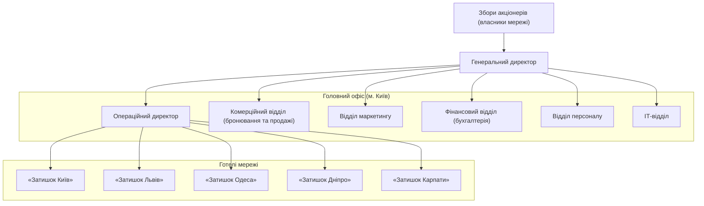
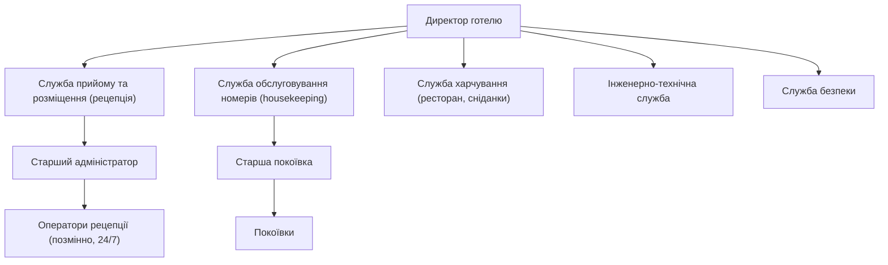

# ЗВІТ №1 з комп'ютерного практикуму

**Тема:** «Типова інформаційна система для мережі готелів»

*Чернетка розділів 4–5 (версія 0.1). Відповідність переліку викладача: розділ 4 звіту = пункт 5 (характеристика користувачів), розділ 5 = пункт 6 (опис організації: структура та підрозділи; акціонери та користувачі системи — найменування, опис, відповідальність).*

---

## 4. ХАРАКТЕРИСТИКА КОРИСТУВАЧІВ

Інформаційна система мережі готелів обслуговує дві принципово різні групи користувачів. **Зовнішні користувачі** — гості мережі — взаємодіють із системою через публічний портал онлайн-бронювання, не є співробітниками організації та можуть мати будь-який рівень комп'ютерної грамотності. **Внутрішні користувачі** — персонал готелів та головного офісу — працюють через захищене робоче місце персоналу, мають облікові записи, призначені адміністратором, і діють у межах прав своєї ролі та свого готелю.

Для кожного внутрішнього користувача система визначає два параметри доступу: **роль** (набір дозволених дій) і **область видимості** (один готель або вся мережа). Персонал готелю бачить лише дані свого готелю; співробітники головного офісу — дані всіх готелів мережі. Такий підхід дозволяє використовувати одну систему для всієї мережі, не розкриваючи персоналу однієї філії інформацію про іншу.

Характеристику користувачів системи зведено в таблиці 4.1.

**Таблиця 4.1 – Характеристика користувачів системи**

| Користувач | Характеристика | Права та обов'язки в системі |
|---|---|---|
| **Гість** | Фізична особа, яка бронює номер для себе або для інших осіб; також контактна особа корпоративного клієнта чи туристичної агенції. Користується порталом з будь-якого пристрою (комп'ютер, смартфон), нерегулярно; рівень підготовки — довільний, тому інтерфейс має бути максимально простим. | Реєстрація та вхід на портал; пошук доступних номерів за містом, датами, кількістю гостей; перегляд цін; створення бронювання; перегляд, зміна (дати, категорія номера) та скасування власних бронювань; перегляд історії проживань; редагування профілю. Зобов'язаний надавати достовірні дані та дотримуватися правил бронювання (терміни скасування). |
| **Оператор рецепції** | Співробітник служби прийому та розміщення конкретного готелю. Працює позмінно, цілодобово, зі стаціонарного комп'ютера на стійці рецепції; використовує систему безперервно протягом зміни; основний внутрішній користувач. Рівень підготовки — впевнений користувач ПК. | Перегляд та створення бронювань свого готелю (для гостей, що звертаються особисто, телефоном чи поштою); заселення гостя з призначенням номера; виселення; продовження проживання; зміна статусу бронювання; ведення профілів гостей; формування рахунку та фіксація оплати; перегляд стану номерів; перегляд історії змін бронювання. Відповідає за коректність даних гостя та своєчасну зміну статусів. |
| **Оператор відділу бронювання** | Співробітник комерційного відділу головного офісу (контакт-центр). Обробляє запити на бронювання по всій мережі, працює з корпоративними клієнтами та туристичними агенціями. Область видимості — вся мережа. | Пошук доступності в усіх готелях; створення, зміна та скасування бронювань для будь-якого готелю; ведення профілів корпоративних клієнтів; перегляд звітів про бронювання. Не має прав на заселення/виселення та розрахунки — ці операції виконує рецепція готелю. |
| **Покоївка** | Працівник служби обслуговування номерів готелю. Працює «в полі», користується системою з планшета або смартфона кілька разів на зміну; потребує простого інтерфейсу з мінімумом дій. | Перегляд списку призначених їй завдань на прибирання; зміна статусу завдання (взято в роботу, виконано); зміна статусу номера на «вільний» після прибирання; позначення виявлених несправностей (номер потребує ремонту). |
| **Старша покоївка** (супервайзер служби обслуговування номерів) | Керівник служби обслуговування номерів готелю. Планує роботу покоївок, контролює якість прибирання. Користується системою з комп'ютера або планшета кілька разів на день. | Усі права покоївки; перегляд усіх завдань на прибирання свого готелю; призначення та перепризначення завдань покоївкам; створення позапланових завдань; переведення номера в статус «на ремонті» та повернення в експлуатацію; перегляд звіту про стан номерного фонду. |
| **Менеджер готелю** (директор готелю) | Керівник конкретного готелю. Відповідає за операційні та фінансові показники філії. Користується системою щодня, переважно для контролю та звітності. Область видимості — свій готель. | Усі права оператора рецепції та старшої покоївки в межах свого готелю; ведення довідників свого готелю (номери, характеристики, тимчасове виведення номерів з експлуатації); перегляд звітів про завантаження, доходи, поточних та очікуваних гостей; перегляд журналу дій персоналу свого готелю. Відповідає за дотримання персоналом регламентів роботи в системі. |
| **Бухгалтер** | Співробітник фінансового відділу головного офісу. Використовує систему як джерело даних про доходи та платежі для бухгалтерського обліку. Область видимості — вся мережа. | Перегляд рахунків і платежів усіх готелів; звіти про доходи за період по готелях і мережі; вивантаження даних для зовнішньої бухгалтерської системи; коригування помилково внесених платежів (із записом у журнал аудиту). Не має прав на зміну бронювань. |
| **Керівництво мережі** (генеральний, операційний, комерційний директори) | Топ-менеджмент головного офісу. Використовує систему для прийняття управлінських рішень; потребує зведених показників, а не операційних деталей. | Перегляд аналітичних звітів по всій мережі (завантаження, доходи, середній тариф, дохід на доступний номер, порівняння готелів); затвердження тарифів. Права лише на перегляд операційних даних. |
| **Адміністратор системи** | Співробітник ІТ-відділу головного офісу. Відповідає за працездатність системи та управління доступом. Рівень підготовки — ІТ-фахівець. | Створення та блокування облікових записів персоналу; призначення ролей та області видимості; ведення загальномережевих довідників (готелі, категорії номерів, тарифи); налаштування системи (параметри сповіщень, правила скасування); перегляд повного журналу аудиту; резервне копіювання та відновлення даних. |

Із таблиці видно, що вимоги різних користувачів до системи суттєво відрізняються: гості та покоївки потребують простих інтерфейсів із мінімальною кількістю дій, оператори рецепції — швидкого робочого місця, розрахованого на безперервну роботу протягом зміни, а керівництво та бухгалтерія — зручних звітів і зведених показників. Ці відмінності будуть враховані під час формування вимог (розділ 6) та проєктування інтерфейсів.

---

## 5. ОПИС ОРГАНІЗАЦІЇ

### 5.1. Структура та підрозділи

Організацією, для якої створюється система, є мережа готелів «Затишок» (умовна назва). Мережа об'єднує п'ять готелів у різних регіонах України та головний офіс у Києві. Склад мережі наведено в таблиці 5.1.

**Таблиця 5.1 – Склад мережі готелів «Затишок»**

| Готель | Місто | Категорія | Кількість номерів | Особливості |
|---|---|---|---|---|
| «Затишок Київ» | Київ | 4 зірки | 120 | Найбільший готель мережі; бізнес-гості, конференції |
| «Затишок Львів» | Львів | 4 зірки | 80 | Туристичний потік, високий сезон — літо та зимові свята |
| «Затишок Одеса» | Одеса | 3 зірки | 90 | Курортний готель, яскраво виражена сезонність |
| «Затишок Дніпро» | Дніпро | 3 зірки | 50 | Бізнес-гості, корпоративні клієнти |
| «Затишок Карпати» | Яремче | 3 зірки | 40 | Гірський курорт, сімейний відпочинок |
| **Разом** | | | **380** | ~200 співробітників |

Організаційна структура мережі є дворівневою: головний офіс виконує стратегічні та централізовані функції, а кожен готель має типову операційну структуру й керується директором готелю, який підпорядковується операційному директору мережі. Структуру мережі показано на рисунку 5.1, типову структуру готелю — на рисунку 5.2.

**Рисунок 5.1 – Організаційна структура мережі готелів «Затишок»**

**Рисунок 5.2 – Типова організаційна структура готелю мережі**

Функції підрозділів та їх зв'язок з інформаційною системою наведено в таблиці 5.2.

**Таблиця 5.2 – Підрозділи організації та їх взаємодія з ІС**

| Підрозділ | Основні функції | Взаємодія з ІС |
|---|---|---|
| **Генеральний директор** | Стратегічне управління мережею, затвердження бюджетів і тарифної політики, звітність перед акціонерами | Аналітичні звіти по мережі; затвердження тарифів |
| **Операційний директор** | Керівництво директорами готелів, впровадження єдиних стандартів обслуговування, контроль операційних показників | Зведені звіти про завантаження та стан номерного фонду всіх готелів; порівняння готелів |
| **Комерційний відділ** (відділ бронювання та продажів) | Центральний контакт-центр для телефонних і поштових запитів; робота з корпоративними клієнтами, туристичними агенціями; управління тарифами та спеціальними пропозиціями | Модуль бронювання (вся мережа); профілі корпоративних клієнтів; довідник тарифів |
| **Відділ маркетингу** | Просування мережі, ведення сайту та соціальних мереж, акції, аналіз попиту | Портал онлайн-бронювання (контент); звіти про джерела бронювань та попит |
| **Фінансовий відділ** (бухгалтерія) | Бухгалтерський та податковий облік, контроль надходжень, розрахунки з корпоративними клієнтами | Модуль розрахунків (перегляд); звіти про доходи та платежі; вивантаження даних |
| **Відділ персоналу** | Наймання, навчання, облік персоналу | Опосередковано: подає заявки на створення облікових записів; використовує документацію користувача для навчання |
| **ІТ-відділ** | Підтримка ІТ-інфраструктури головного офісу та готелів, адміністрування системи, інформаційна безпека | Модуль адміністрування: облікові записи, ролі, довідники, налаштування, резервне копіювання, журнал аудиту |
| **Директор готелю** | Операційне управління готелем, персонал, якість обслуговування, виконання планових показників | Звіти по готелю; довідник номерів свого готелю; журнал дій персоналу |
| **Служба прийому та розміщення** | Зустріч гостей, бронювання на місці, заселення та виселення, розрахунки з гостями, інформаційна підтримка гостей | Основний користувач модулів бронювання, прийому та розміщення, обліку гостей, розрахунків |
| **Служба обслуговування номерів** | Прибирання номерів та громадських зон, підготовка номерів до заселення, контроль стану номерів, передача інформації про несправності | Модуль обслуговування номерів: завдання на прибирання, статуси номерів |
| **Служба харчування** | Ресторан, сніданки, обслуговування в номерах | У першій версії системи не автоматизується; додаткові послуги вносить рецепція вручну (напрям розширення — інтеграція з ресторанною системою) |
| **Інженерно-технічна служба** | Обслуговування будівлі та інженерних систем, ремонт номерів | Отримує інформацію про номери зі статусом «на ремонті»; повертає номер в експлуатацію через старшу покоївку або директора |
| **Служба безпеки** | Охорона, контроль доступу, відеоспостереження | Не використовує систему безпосередньо |

### 5.2. Акціонери та користувачі системи

Зацікавлені сторони (стейкхолдери) проєкту — це особи та організації, які впливають на систему або на яких впливає її впровадження. Для кожної сторони визначено її інтерес щодо системи та відповідальність у проєкті (таблиця 5.3). Зацікавлені сторони поділено на три групи: власники та керівництво, персонал-користувачі, зовнішні сторони.

**Таблиця 5.3 – Зацікавлені сторони проєкту**

| Найменування | Опис | Інтерес щодо системи та відповідальність |
|---|---|---|
| **Акціонери (власники мережі)** | Інвестори, які володіють мережею та фінансують проєкт | Інтерес: зростання доходу та прибутковості мережі, прозорість показників кожного готелю, зниження операційних витрат, захист від репутаційних ризиків. Відповідальність: затвердження бюджету проєкту, ухвалення рішення про впровадження. |
| **Генеральний директор** | Вища посадова особа мережі; спонсор проєкту з боку замовника | Інтерес: єдина картина бізнесу в реальному часі, керованість мережі. Відповідальність: визначення пріоритетів, затвердження вимог і результатів етапів, забезпечення підтримки проєкту в організації. |
| **Операційний директор** | Керівник операційної діяльності всіх готелів; Product Owner з боку замовника | Інтерес: єдині стандарти роботи, контроль стану номерного фонду, оперативні звіти. Відповідальність: формулювання та пріоритизація вимог, приймання функціоналу, організація впровадження в готелях. |
| **Комерційний директор та відділ бронювання** | Керівник і співробітники комерційного відділу | Інтерес: доступність усієї мережі «з одного вікна», зменшення втрачених бронювань, зручна робота з корпоративними клієнтами. Відповідальність: надання вимог до процесу бронювання і тарифів, тестування модуля бронювання. |
| **Фінансовий директор та бухгалтерія** | Керівник і співробітники фінансового відділу | Інтерес: точні дані про доходи та платежі, відсутність розбіжностей між готелями, придатність даних для бухгалтерського обліку. Відповідальність: вимоги до розрахунків і звітів, звірка даних під час впровадження. |
| **Директори готелів** | Керівники п'яти готелів мережі | Інтерес: зменшення ручної роботи персоналу, контроль показників свого готелю, відсутність конфліктів між рецепцією та службою обслуговування. Відповідальність: організація навчання персоналу, дотримання регламентів роботи в системі. |
| **Персонал рецепції** | Оператори рецепції всіх готелів | Інтерес: швидке та надійне робоче місце, менше помилок, менше телефонних узгоджень. Відповідальність: коректне введення даних, дотримання процесів заселення/виселення. |
| **Служба обслуговування номерів** | Старші покоївки та покоївки | Інтерес: чіткі завдання без усних узгоджень, простий мобільний інтерфейс. Відповідальність: своєчасне оновлення статусів завдань та номерів. |
| **ІТ-відділ** | ІТ-фахівці головного офісу | Інтерес: керована, безпечна система, яку можна підтримувати власними силами. Відповідальність: підготовка інфраструктури, адміністрування, резервне копіювання, перша лінія підтримки користувачів. |
| **Гості (індивідуальні)** | Клієнти мережі, які бронюють номери для себе | Інтерес: швидке бронювання без дзвінків, прозорі ціни, можливість керувати бронюванням, захист персональних даних. Відповідальність: достовірність даних, дотримання умов бронювання. |
| **Корпоративні клієнти та туристичні агенції** | Організації, які регулярно розміщують своїх співробітників або туристів у готелях мережі | Інтерес: єдині умови в усіх готелях, безготівкові розрахунки, звіти про проживання своїх людей. Відповідальність: дотримання договірних умов. |
| **Постачальники зовнішніх сервісів** | Хмарний або хостинг-провайдер, платіжний провайдер, сервіс електронної пошти | Інтерес: комерційний. Відповідальність: надання сервісів відповідно до угод про рівень обслуговування (SLA); є джерелом зовнішніх ризиків проєкту. |
| **Державні органи** | Податкова служба; органи контролю за дотриманням законодавства про захист персональних даних | Інтерес: дотримання вимог щодо фіскалізації розрахунків та обробки персональних даних. Відповідальність: нормативні вимоги, які система має враховувати. |
| **Команда розробки** | Виконавець проєкту (у межах практикуму — команда з двох студентів) | Інтерес: реалізація системи відповідно до вимог у встановлені терміни. Відповідальність: аналіз, проєктування, розроблення, тестування, документування, впровадження. |

Для визначення пріоритетів у роботі із зацікавленими сторонами застосовано класифікацію за впливом на проєкт та інтересом до нього — матрицю «вплив — інтерес», рекомендовану в практиці управління проєктами [1] (таблиця 5.4).

**Таблиця 5.4 – Класифікація зацікавлених сторін за впливом та інтересом**

| | **Високий інтерес** | **Низький інтерес** |
|---|---|---|
| **Високий вплив** | Генеральний директор, операційний директор (Product Owner), комерційний директор — залучати до всіх ключових рішень, погоджувати вимоги та результати етапів | Акціонери, державні органи — інформувати про стан проєкту, забезпечувати виконання нормативних вимог |
| **Низький вплив** | Персонал рецепції, служба обслуговування номерів, директори готелів, ІТ-відділ, гості — регулярно збирати зворотний зв'язок, залучати до тестування та навчання | Відділ маркетингу, відділ персоналу, служба харчування, постачальники сервісів — інформувати за потреби |

Із таблиць 5.3 та 5.4 випливає, що ключовими особами для проєкту є генеральний та операційний директори як замовники й приймальники результату, а найчисленнішими користувачами, від яких залежить успіх впровадження, — персонал рецепції та служби обслуговування номерів. Саме їх сценарії роботи покладено в основу функціональних вимог (розділ 6) і сценаріїв користувача (розділ 8).
