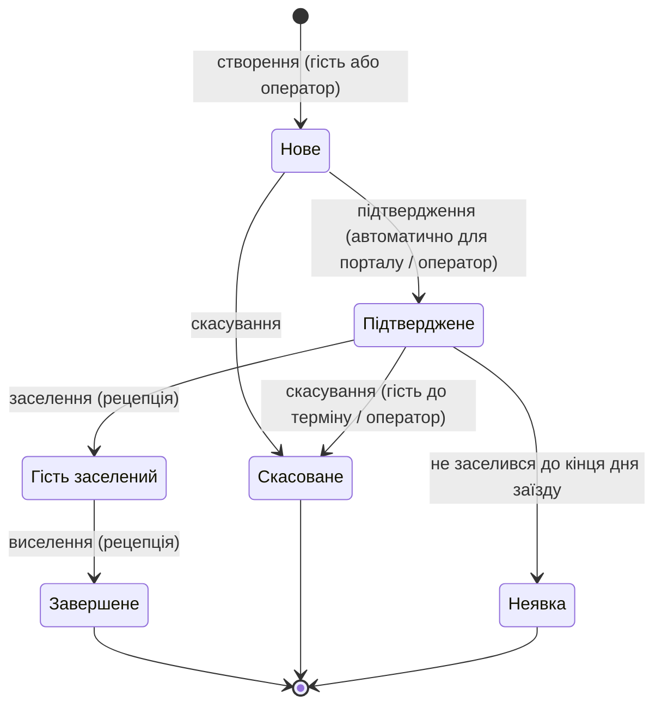
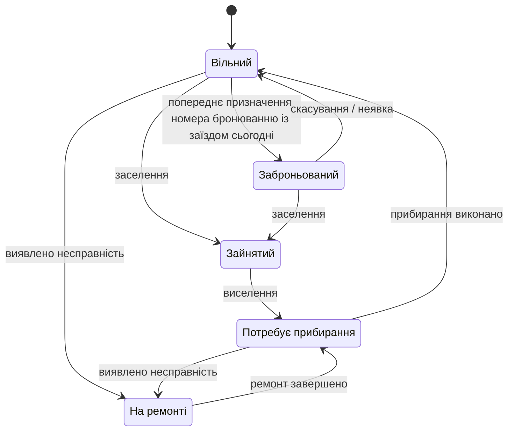

# ЗВІТ №1 з комп'ютерного практикуму

**Тема:** «Типова інформаційна система для мережі готелів»

*Чернетка розділу 6 (версія 0.1). Відповідність переліку викладача: розділ 6 звіту = пункт 7 (специфікація вимог: основні функції продукту — функціональні можливості та опис; функціональні вимоги — назва та опис; нефункціональні вимоги — назва та опис).*

---

## 6. СПЕЦИФІКАЦІЯ ВИМОГ

Вимоги до системи сформовано на основі аналізу проблем (розділ 3.1), обсягу продукту (розділ 3.4), характеристики користувачів (розділ 4) та структури організації (розділ 5). Структуру специфікації узгоджено з рекомендаціями стандарту ISO/IEC/IEEE 29148 [2]. Кожній вимозі присвоєно ідентифікатор (FR — функціональна, NFR — нефункціональна), який надалі використовується для простежуваності: у сценаріях користувача, архітектурних рішеннях, проєкті бази даних і тестуванні буде вказано, які саме вимоги вони реалізують або перевіряють.

Пріоритет вимог визначено за методом MoSCoW [3]: **M** (Must) — обов'язкова, без неї система не виконує свого призначення; **S** (Should) — важлива, реалізується у першій версії, якщо дозволяють терміни; **C** (Could) — бажана, реалізується за наявності ресурсів або в наступних версіях. У межах комп'ютерного практикуму реалізуються всі вимоги з пріоритетом M та частина вимог S.

### 6.1. Основні функції продукту

Система надає користувачам такі функціональні можливості, згруповані за модулями продукту (розділ 3.4).

**1. Управління доступом та адміністрування.** Система розрізняє гостей (самостійна реєстрація на порталі) і персонал (облікові записи створює адміністратор). Кожен внутрішній користувач має роль та область видимості (свій готель або вся мережа), які визначають доступні йому функції та дані. Адміністратор веде загальномережеві довідники: готелі, категорії номерів, тарифи, додаткові послуги. Усі значущі дії користувачів фіксуються в журналі аудиту.

**2. Управління номерним фондом.** Для кожного готелю ведеться перелік номерів із категорією, місткістю, поверхом і зручностями. Кожен номер у будь-який момент має один із визначених статусів (вільний, заброньований, зайнятий, потребує прибирання, на ремонті), які змінюються автоматично в результаті операцій заселення, виселення та прибирання або вручну уповноваженим персоналом. Для категорій номерів у кожному готелі задаються тарифи з урахуванням сезонних періодів.

**3. Бронювання.** Гість через портал або оператор через робоче місце шукає доступні номери за містом чи готелем, датами та кількістю гостей, бачить вартість проживання й оформлює бронювання. Бронювання проходить визначений життєвий цикл (нове → підтверджене → гість заселений → завершене, з можливістю скасування або фіксації неявки), а кожна зміна зберігається в історії із зазначенням автора та часу. Доступність номерів контролюється централізовано, що виключає подвійні бронювання.

**4. Прийом та розміщення.** Оператор рецепції заселяє гостя, призначаючи конкретний номер потрібної категорії з-поміж вільних і прибраних, виселяє гостя із закриттям рахунку та автоматичним створенням завдання на прибирання, продовжує проживання за наявності вільного номера. Панель поточного стану показує заїзди та виїзди на сьогодні і зайнятість готелю.

**5. Облік гостей.** Ведеться єдина база гостей мережі з профілем, документними та контактними даними, побажаннями та історією проживань у всіх готелях. Окремо обліковуються корпоративні клієнти з договірними умовами.

**6. Обслуговування номерів.** Завдання на прибирання створюються автоматично після виселення або вручну старшою покоївкою, призначаються покоївкам і виконуються з відміткою у мобільному інтерфейсі; після виконання номер автоматично стає вільним. Виявлені несправності переводять номер у статус «на ремонті» і виключають його з продажу.

**7. Розрахунки.** Для кожного проживання формується рахунок за проживання та додаткові послуги; фіксуються платежі різними способами; рахунок має стан (відкритий, частково оплачений, оплачений).

**8. Звітність та аналітика.** Керівництво та бухгалтерія отримують звіти про завантаження, доходи, середній тариф (ADR) і дохід на доступний номер (RevPAR) по кожному готелю та мережі, а рецепція — оперативні звіти про очікувані заїзди, виїзди та стан номерів.

**9. Сповіщення.** Гості отримують електронною поштою підтвердження бронювання, повідомлення про зміни та скасування, нагадування перед заїздом.

### 6.2. Функціональні вимоги

#### 6.2.1. Моделі станів ключових сутностей

Оскільки значна частина функціональних вимог стосується зміни статусів, спочатку визначено моделі станів для чотирьох сутностей: бронювання, номера, завдання на прибирання та рахунку (рисунки 6.1–6.2, таблиця 6.1).

**Рисунок 6.1 – Життєвий цикл бронювання**

**Рисунок 6.2 – Стани номера**

**Таблиця 6.1 – Стани завдання на прибирання та рахунку**

| Сутність | Стани | Переходи |
|---|---|---|
| Завдання на прибирання | Нове → Призначене → В роботі → Виконано; Скасоване | Нове створюється автоматично після виселення або вручну; старша покоївка призначає виконавця; покоївка бере в роботу та завершує; після «Виконано» номер переходить у стан «Вільний» |
| Рахунок | Відкритий → Частково оплачений → Оплачений; Анульований | Відкривається при заселенні; кожен платіж змінює стан залежно від суми; закривається при виселенні; анулювання — лише бухгалтером із записом в аудит |

#### 6.2.2. Перелік функціональних вимог

Функціональні вимоги наведено в таблиці 6.2, згруповані за модулями. Для кожної вимоги вказано ролі, яким вона доступна (за розділом 4), та пріоритет.

**Таблиця 6.2 – Функціональні вимоги**

| ID | Назва | Опис | Ролі | Пріоритет |
|---|---|---|---|---|
| **Модуль адміністрування та безпеки** | | | | |
| FR-01 | Автентифікація користувачів | Вхід за логіном (електронна пошта) і паролем. Гості реєструються самостійно на порталі з підтвердженням електронної пошти; облікові записи персоналу створює адміністратор. Після 5 невдалих спроб входу обліковий запис тимчасово блокується. | Усі | M |
| FR-02 | Рольовий доступ та область видимості | Кожному внутрішньому користувачу призначається одна роль (розділ 4) і область видимості: конкретний готель або вся мережа. Система відображає та дозволяє змінювати лише дані в межах області видимості; спроби доступу поза нею відхиляються. | Система | M |
| FR-03 | Управління обліковими записами персоналу | Створення, редагування, блокування та розблокування облікових записів; призначення ролі та готелю; скидання пароля. Видалення облікових записів не передбачене — лише блокування, щоб зберегти історію дій. | Адміністратор | M |
| FR-04 | Журнал аудиту | Фіксація всіх операцій створення, зміни статусу та видалення бронювань, рахунків, платежів, номерів, облікових записів: хто, коли, яку сутність, які поля змінено (старе та нове значення). Перегляд журналу з фільтрами за користувачем, сутністю, періодом. | Адміністратор (вся мережа), менеджер готелю (свій готель) | M |
| FR-05 | Ведення довідників мережі | Створення та редагування готелів (назва, місто, адреса, категорія, часовий пояс, контакти), категорій номерів (назва, опис, базова місткість), додаткових послуг (назва, ціна). Готель можна деактивувати, але не видалити, якщо за ним є бронювання. | Адміністратор | M |
| **Модуль управління номерним фондом** | | | | |
| FR-06 | Ведення номерів готелю | Створення та редагування номерів: номер (унікальний у межах готелю), поверх, категорія, місткість, перелік зручностей, примітки. Номер можна вивести з експлуатації (статус «на ремонті») або деактивувати. | Менеджер готелю, адміністратор | M |
| FR-07 | Статуси номера | Підтримка станів номера та переходів за рисунком 6.2. Автоматичні переходи виконує система (заселення, виселення, завершення прибирання); ручні переходи («на ремонті» і назад) — старша покоївка або менеджер готелю. Кожна зміна статусу фіксується в аудиті. | Система, старша покоївка, менеджер готелю | M |
| FR-08 | Тарифи | Для кожної пари «готель — категорія номера» задається базова ціна за ніч; додатково задаються сезонні періоди (дата початку, дата кінця, ціна), які мають пріоритет над базовою ціною. Вартість проживання розраховується як сума цін за кожну ніч періоду. Тарифи затверджує керівництво, вносить адміністратор або комерційний відділ. | Адміністратор, оператор відділу бронювання, керівництво (перегляд) | M |
| FR-09 | Контроль доступності | Для запиту «готель, категорія, дата заїзду, дата виїзду» система обчислює кількість доступних номерів як кількість активних номерів категорії (крім тих, що на ремонті) мінус кількість бронювань тієї самої категорії у статусах «підтверджене» та «гість заселений», період яких перетинається із запитом. Створення бронювання за відсутності доступних номерів неможливе; перевірка виконується в одній транзакції з вставленням бронювання, щоб два одночасні запити не створили подвійного бронювання. | Система | M |
| **Модуль бронювання** | | | | |
| FR-10 | Пошук доступних номерів | Пошук за містом або готелем, датами заїзду та виїзду, кількістю гостей. Результат — перелік категорій номерів з наявною кількістю, описом, зручностями та загальною вартістю проживання за обраний період. Дата виїзду має бути пізнішою за дату заїзду; дата заїзду — не раніше поточної. | Гість, оператор рецепції, оператор відділу бронювання | M |
| FR-11 | Створення бронювання гостем | Авторизований гість обирає категорію з результатів пошуку, вказує кількість гостей та побажання і підтверджує бронювання. Система створює бронювання у статусі «нове», перевіряє доступність (FR-09), автоматично переводить у «підтверджене» та надсилає підтвердження (FR-39). | Гість | M |
| FR-12 | Створення бронювання оператором | Оператор створює бронювання для існуючого або нового гостя (профіль створюється одразу) або для корпоративного клієнта, вказуючи джерело (телефон, пошта, особисто, агенція). Оператор рецепції — лише для свого готелю; оператор відділу бронювання — для будь-якого. | Оператор рецепції, оператор відділу бронювання | M |
| FR-13 | Підтвердження бронювання | Бронювання, створене оператором, може залишатися у статусі «нове» до отримання підтвердження від гостя (наприклад, передоплати) і переводиться у «підтверджене» оператором вручну. | Оператор рецепції, оператор відділу бронювання | S |
| FR-14 | Зміна бронювання | Зміна дат, категорії номера, кількості гостей або побажань для бронювань у статусах «нове» та «підтверджене». Система повторно перевіряє доступність та перераховує вартість. Гість змінює лише власні бронювання; після заселення зміни виконує рецепція через продовження проживання (FR-21). | Гість, оператор рецепції, оператор відділу бронювання | M |
| FR-15 | Скасування бронювання та неявка | Гість може скасувати бронювання до настання граничного терміну (за замовчуванням — до 18:00 дня, що передує заїзду; параметр налаштовується адміністратором); оператор — у будь-який момент до заселення із зазначенням причини. Бронювання у статусі «підтверджене», за яким гість не заселився до кінця дня заїзду, система автоматично переводить у статус «неявка». | Гість, оператор рецепції, оператор відділу бронювання, система | M |
| FR-16 | Життєвий цикл бронювання | Підтримка станів та переходів за рисунком 6.1; заборонені переходи (наприклад, скасування завершеного бронювання) відхиляються з повідомленням. | Система | M |
| FR-17 | Історія змін бронювання | Для кожного бронювання зберігається хронологія: створення, кожна зміна полів, зміна статусу — з автором, часом і значеннями до/після. Історія доступна в картці бронювання; гість бачить історію власних бронювань. | Усі, хто має доступ до бронювання | M |
| FR-18 | Перегляд бронювань | Список бронювань з фільтрами за готелем, статусом, датами заїзду/виїзду, прізвищем гостя, джерелом; картка бронювання з повною інформацією. Гість бачить лише свої бронювання. | Гість, оператор рецепції, оператор відділу бронювання, менеджер готелю | M |
| **Модуль прийому та розміщення** | | | | |
| FR-19 | Заселення гостя | Для бронювання у статусі «підтверджене» на дату заїзду оператор обирає конкретний номер потрібної категорії зі станом «вільний» або «заброньований» (попередньо призначений), перевіряє дані гостя, вносить документні дані. Система переводить бронювання у «гість заселений», номер — у «зайнятий», відкриває рахунок (FR-31). Заселення гостя без бронювання виконується через створення бронювання (FR-12) з негайним заселенням. | Оператор рецепції | M |
| FR-20 | Виселення гостя | Оператор перевіряє рахунок, фіксує остаточну оплату, завершує проживання. Система переводить бронювання у «завершене», номер — у «потребує прибирання», закриває рахунок і автоматично створює завдання на прибирання (FR-27). Виселення з неоплаченим рахунком потребує підтвердження менеджера готелю. | Оператор рецепції, менеджер готелю | M |
| FR-21 | Продовження проживання | Для заселеного гостя оператор змінює дату виїзду; система перевіряє, чи номер не заброньований іншим гостем на новий період, і перераховує рахунок. Якщо номер зайнятий — пропонує вільні номери тієї самої категорії для переселення. | Оператор рецепції | S |
| FR-22 | Панель поточного стану готелю | Зведення на поточну дату: очікувані заїзди, очікувані виїзди, заселені гості, кількість номерів за кожним статусом; швидкий перехід до заселення/виселення. | Оператор рецепції, менеджер готелю | M |
| **Модуль обліку гостей** | | | | |
| FR-23 | Профіль гостя | Прізвище, ім'я, по батькові, дата народження, громадянство, тип і номер документа, телефон, електронна пошта, побажання (поверх, тип ліжка тощо), примітки персоналу. Документні дані обов'язкові лише при заселенні. Гість редагує власний профіль на порталі, крім документних даних, внесених персоналом. | Гість (свій профіль), оператор рецепції, оператор відділу бронювання | M |
| FR-24 | Пошук гостя | Пошук профілю за прізвищем, телефоном, електронною поштою або номером документа для запобігання дублюванню під час створення бронювання оператором. | Оператор рецепції, оператор відділу бронювання | M |
| FR-25 | Історія проживань гостя | Перелік усіх бронювань гостя в усіх готелях мережі з датами, готелем, категорією, вартістю та статусом. | Оператор рецепції, оператор відділу бронювання, менеджер готелю, гість (свої) | S |
| FR-26 | Корпоративні клієнти | Облік організацій: назва, код ЄДРПОУ, договір (номер, термін), умови оплати (безготівковий розрахунок з відстроченням), контактна особа. Бронювання можна прив'язати до корпоративного клієнта; рахунок такого бронювання виставляється організації. | Оператор відділу бронювання, бухгалтер | S |
| **Модуль обслуговування номерів** | | | | |
| FR-27 | Створення завдань на прибирання | Автоматично після кожного виселення (FR-20); вручну старшою покоївкою — позапланове або планове прибирання зайнятого номера. Завдання містить готель, номер, тип (після виїзду / поточне / генеральне), пріоритет, термін. | Система, старша покоївка | M |
| FR-28 | Призначення завдань | Старша покоївка призначає або перепризначає завдання покоївці свого готелю; покоївка бачить лише призначені їй завдання, відсортовані за пріоритетом і терміном. | Старша покоївка, покоївка | M |
| FR-29 | Виконання завдань | Покоївка переводить завдання у «в роботі» та «виконано» з мобільного пристрою. Після статусу «виконано» для прибирання після виїзду система автоматично переводить номер у стан «вільний». | Покоївка, система | M |
| FR-30 | Облік несправностей | Покоївка або старша покоївка позначає номер як несправний із описом проблеми; номер переходить у стан «на ремонті» і виключається з доступності (FR-09). Повернення в експлуатацію виконує старша покоївка або менеджер готелю після усунення несправності. | Покоївка, старша покоївка, менеджер готелю | M |
| **Модуль розрахунків** | | | | |
| FR-31 | Формування рахунку | При заселенні автоматично створюється рахунок з позицією «проживання» (кількість ночей × тариф за FR-08). При зміні дат позиція перераховується. | Система | M |
| FR-32 | Додаткові послуги | Оператор додає до відкритого рахунку позиції з довідника послуг (сніданок, паркування, трансфер тощо) із кількістю; вартість підставляється з довідника, може бути змінена з фіксацією в аудиті. | Оператор рецепції | S |
| FR-33 | Фіксація платежів | Внесення платежу: дата, сума, спосіб (готівка, платіжна картка, безготівковий переказ), примітка. Система оновлює стан рахунку (таблиця 6.1). Можлива часткова та повна оплата, а також передоплата до заселення. | Оператор рецепції, бухгалтер | M |
| FR-34 | Друк рахунку | Формування рахунку у форматі PDF для друку або надсилання гостю. | Оператор рецепції | C |
| **Модуль звітності та аналітики** | | | | |
| FR-35 | Звіт про завантаження | Для обраного періоду і готелю (або мережі): кількість доступних номеро-ночей, зайнятих номеро-ночей, відсоток завантаження; розбивка по днях або місяцях. | Менеджер готелю, керівництво, бухгалтер | M |
| FR-36 | Звіт про доходи | Для періоду і готелю (або мережі): дохід від проживання, дохід від послуг, середній тариф (ADR = дохід від проживання / зайняті номеро-ночі), дохід на доступний номер (RevPAR = дохід від проживання / доступні номеро-ночі); порівняння готелів. | Менеджер готелю, керівництво, бухгалтер | M |
| FR-37 | Оперативні звіти | Очікувані заїзди та виїзди на дату, список поточних гостей, стан номерного фонду, незакриті рахунки. | Оператор рецепції, менеджер готелю | S |
| FR-38 | Експорт звітів | Вивантаження будь-якого звіту у форматі CSV або Excel для подальшої обробки в бухгалтерських системах. | Бухгалтер, керівництво, менеджер готелю | S |
| **Модуль сповіщень** | | | | |
| FR-39 | Сповіщення про бронювання | Автоматичне надсилання гостю електронного листа при підтвердженні, зміні та скасуванні бронювання з деталями (готель, дати, категорія, вартість, умови скасування). Невдалі відправлення повторюються та фіксуються в журналі. | Система | M |
| FR-40 | Нагадування перед заїздом | Автоматичний лист за добу до заїзду з адресою готелю, часом заселення та контактами. | Система | C |

Усього визначено 40 функціональних вимог: 31 з пріоритетом M, 7 — S, 2 — C.

### 6.3. Нефункціональні вимоги

Нефункціональні вимоги визначають якісні характеристики системи та обмеження на її реалізацію (таблиця 6.3); категорії вимог узгоджено з характеристиками якості моделі ISO/IEC 25010 [4]. Кількісні значення встановлено, виходячи з масштабу мережі (380 номерів, близько 200 співробітників, з яких системою одночасно користуються не більше ніж кілька десятків) з дворазовим запасом на зростання.

**Таблиця 6.3 – Нефункціональні вимоги**

| ID | Категорія | Назва | Опис |
|---|---|---|---|
| NFR-01 | Продуктивність | Час відгуку | Час відповіді на типові операції (відкриття картки, збереження, зміна статусу) — не більше ніж 2 с при нормальному навантаженні; пошук доступності по всій мережі — не більше ніж 3 с; формування звіту за рік — не більше ніж 10 с. |
| NFR-02 | Продуктивність | Пропускна здатність | Одночасна робота не менше ніж 100 внутрішніх користувачів та 500 відвідувачів порталу без деградації часу відгуку понад NFR-01. |
| NFR-03 | Доступність | Режим роботи | Система працює цілодобово без вихідних. Цільова доступність — 99,5 % на місяць (сумарний простій не більше ніж 3,6 год), планові роботи проводяться у вікні 03:00–05:00 за київським часом із попередженням користувачів. |
| NFR-04 | Надійність | Цілісність даних | Операції, що змінюють стан кількох сутностей (заселення, виселення, створення бронювання з перевіркою доступності), виконуються атомарно: або повністю, або не виконуються взагалі. Подвійне бронювання одного номера чи перевищення кількості номерів категорії неможливе за будь-якої кількості одночасних запитів. |
| NFR-05 | Надійність | Резервне копіювання та відновлення | Повна резервна копія бази даних щодня, інкрементальна — щогодини; зберігання копій не менше ніж 30 днів у сховищі, відокремленому від основного сервера. Допустима втрата даних (RPO) — не більше ніж 1 год; час відновлення після відмови (RTO) — не більше ніж 4 год. |
| NFR-06 | Безпека | Захист каналу зв'язку | Уся взаємодія клієнтів із системою — лише через HTTPS (TLS 1.2 і вище); незахищені з'єднання перенаправляються на захищені. |
| NFR-07 | Безпека | Зберігання паролів та сесій | Паролі зберігаються лише у вигляді хешів з використанням сучасного алгоритму (bcrypt або Argon2); мінімальна довжина пароля персоналу — 10 символів; сесія персоналу завершується після 12 год або 30 хв бездіяльності, гостя — після 30 днів. |
| NFR-08 | Безпека | Розмежування доступу | Перевірка ролі та області видимості (FR-02) виконується на сервері для кожного запиту незалежно від інтерфейсу; клієнтська частина лише приховує недоступні функції. |
| NFR-09 | Безпека та законодавство | Захист персональних даних | Обробка персональних даних гостей відповідно до Закону України «Про захист персональних даних» [5]; для гостей з ЄС — з урахуванням GDPR [6]. На порталі отримується згода на обробку даних; збираються лише дані, необхідні для проживання; документні дані доступні лише операторам рецепції та менеджерам; передбачено видалення або знеособлення даних гостя за його запитом після завершення встановлених термінів зберігання. |
| NFR-10 | Безпека | Аудит | Журнал аудиту (FR-04) захищений від зміни та видалення користувачами, зберігається не менше ніж 3 роки. |
| NFR-11 | Зручність використання | Інтерфейс персоналу | Основні операції рецепції (пошук бронювання, заселення, виселення) виконуються не більше ніж за 5 дій; робоче місце оптимізоване для роботи з клавіатури; інтерфейс українською мовою. |
| NFR-12 | Зручність використання | Мобільний інтерфейс служби обслуговування | Інтерфейс покоївки адаптований до екранів смартфонів і планшетів (від 360 px), кожне завдання закривається не більше ніж за 2 дотики. |
| NFR-13 | Зручність використання | Портал гостя | Портал адаптивний для мобільних пристроїв; бронювання від пошуку до підтвердження — не більше ніж 4 кроки; інтерфейс українською, додатково англійською (пріоритет S). |
| NFR-14 | Зручність використання | Навчання | Персонал рецепції освоює основні операції за один робочий день за документацією користувача; покоївки — за одну годину інструктажу. |
| NFR-15 | Масштабованість | Зростання мережі | Додавання нового готелю виконується введенням довідників без зміни коду; архітектура має витримувати зростання до 20 готелів і 2000 номерів шляхом збільшення ресурсів серверів або кількості екземплярів застосунку. |
| NFR-16 | Супроводжуваність | Структура та документування коду | Модульна структура проєкту з відокремленням бізнес-логіки від інтерфейсу та доступу до даних; вихідний код у системі контролю версій; зміни схеми бази даних — лише через міграції; ключова бізнес-логіка (доступність, розрахунок вартості, переходи станів) покрита автоматичними тестами. |
| NFR-17 | Сумісність | Клієнтське середовище | Робота в актуальних версіях браузерів Chrome, Firefox, Edge, Safari без встановлення додаткового програмного забезпечення на робочі місця. |
| NFR-18 | Сумісність | Серверне середовище | Серверна частина розгортається у вигляді контейнерів на Linux та може працювати як у хмарній інфраструктурі, так і на власному обладнанні головного офісу. |
| NFR-19 | Спостережуваність | Журналювання та моніторинг | Централізоване журналювання помилок і ключових подій; перевірка стану (health check) для кожного компонента; сповіщення ІТ-відділу про недоступність компонента протягом 5 хв. |
| NFR-20 | Локалізація | Час, дати, валюта | Усі дати та час зберігаються в UTC і відображаються в часовому поясі готелю; розрахунки в гривні з точністю до копійки; дата заїзду/виїзду трактується як календарна дата готелю. |
| NFR-21 | Інтеграція | Готовність до інтеграцій | Уся функціональність доступна через документований програмний інтерфейс (REST API), що дозволяє в майбутньому підключити мобільний застосунок, сторонні майданчики бронювання та бухгалтерські системи без зміни ядра. |

### 6.4. Простежуваність вимог

Для контролю повноти вимог побудовано матрицю відповідності між ролями користувачів (розділ 4) та модулями системи (таблиця 6.4). Символ «●» означає, що роль є основним користувачем модуля, «○» — користується частиною функцій, порожня клітинка — доступу немає.

**Таблиця 6.4 – Матриця «ролі — модулі»**

| Роль | Адмін. | Номерний фонд | Бронювання | Прийом і розміщення | Гості | Обслуг. номерів | Розрахунки | Звітність | Сповіщення |
|---|---|---|---|---|---|---|---|---|---|
| Гість | | | ● | | ○ | | | | ● |
| Оператор рецепції | | ○ | ● | ● | ● | | ● | ○ | |
| Оператор відділу бронювання | | ○ | ● | | ● | | | ○ | |
| Покоївка | | | | | | ● | | | |
| Старша покоївка | | ○ | | | | ● | | ○ | |
| Менеджер готелю | ○ | ● | ○ | ○ | ○ | ○ | ○ | ● | |
| Бухгалтер | | | | | ○ | | ● | ● | |
| Керівництво мережі | | ○ | | | | | | ● | |
| Адміністратор системи | ● | ● | | | | | | | ○ |

Кожна роль має доступ щонайменше до одного модуля, і кожен модуль має принаймні одного основного користувача, що підтверджує узгодженість характеристики користувачів, обсягу продукту та функціональних вимог. Зв'язок вимог із бізнес-цілями буде показано в розділі 7, а реалізація вимог у сценаріях — у розділі 8.
