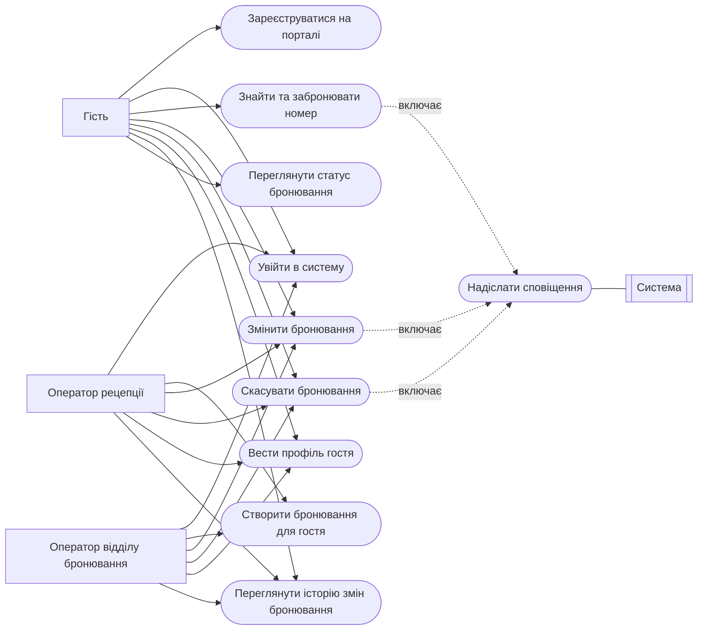
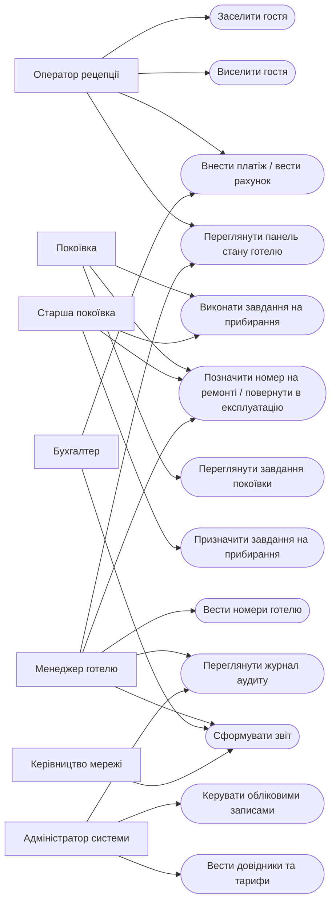
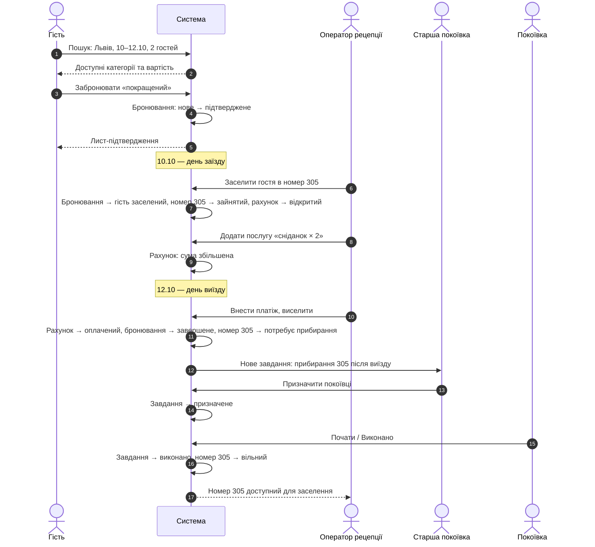

# ЗВІТ №1 з комп'ютерного практикуму

**Тема:** «Типова інформаційна система для мережі готелів»

*Чернетка розділу 8 (версія 0.1). Відповідність переліку викладача: розділ 8 звіту = пункт 9 (сценарії користувача: вхід в систему; створення, редагування, видалення сутностей; зміна статусу; історія змін; відображення статусу).*

---

## 8. СЦЕНАРІЇ КОРИСТУВАЧА

Сценарії користувача описують, як користувачі кожної ролі (розділ 4) досягають своїх цілей за допомогою системи. Сценарії подано у формі прецедентів (use cases) за методикою А. Кокберна [7]: для кожного вказано актора, передумови, основний потік подій, альтернативні потоки та післяумову — зокрема, які саме стани сутностей змінюються (моделі станів — розділ 6.2.1). Кожен сценарій простежено до функціональних вимог (розділ 6.2), а наприкінці розділу наведено матрицю покриття.

Сценарії згруповано за п'ятьма видами дій, які має підтримувати система: вхід у систему; створення, редагування та видалення сутностей; зміна статусу; історія змін; відображення статусу. Окремо описано наскрізний сценарій «від бронювання до виселення», який показує взаємодію ролей і послідовну зміну станів бронювання, номера, рахунку та завдання на прибирання.

### 8.1. Діаграми прецедентів

Прецеденти системи та їх зв'язок з акторами показано на рисунках 8.1 (портал гостя та бронювання) і 8.2 (операційна діяльність готелю, звітність та адміністрування). Актори зображено прямокутниками, прецеденти — овалами.

**Рисунок 8.1 – Діаграма прецедентів: портал гостя та бронювання**

**Рисунок 8.2 – Діаграма прецедентів: операційна діяльність, звітність, адміністрування**

### 8.2. Вхід у систему

**UC-01. Реєстрація гостя на порталі**

- *Актор:* гість. *Вимоги:* FR-01, FR-23, NFR-09.
- *Передумова:* гість не має облікового запису.
- *Основний потік:*
  1. Гість відкриває портал і обирає «Зареєструватися».
  2. Вводить ім'я, прізвище, електронну пошту, телефон, пароль (двічі) та підтверджує згоду на обробку персональних даних.
  3. Система перевіряє унікальність електронної пошти та складність пароля, створює обліковий запис у стані «не підтверджений» і надсилає лист із посиланням для підтвердження.
  4. Гість переходить за посиланням; система активує обліковий запис і відкриває особистий кабінет.
- *Альтернативні потоки:* А1 — електронна пошта вже використовується: система пропонує увійти або відновити пароль. А2 — посилання не підтверджене протягом 24 годин: обліковий запис видаляється, реєстрацію можна повторити.
- *Післяумова:* створено профіль гостя, пов'язаний з обліковим записом.

**UC-02. Вхід у систему**

- *Актори:* гість, увесь персонал. *Вимоги:* FR-01, FR-02, NFR-07, NFR-08.
- *Передумова:* обліковий запис існує та активний.
- *Основний потік:*
  1. Користувач відкриває сторінку входу (портал — для гостей, робоче місце персоналу — за окремою адресою) і вводить електронну пошту та пароль.
  2. Система перевіряє облікові дані, роль та область видимості, створює сесію і відкриває початковий екран, що відповідає ролі: гостю — особистий кабінет з бронюваннями; оператору рецепції — панель стану готелю; покоївці — список завдань; менеджеру та керівництву — зведені показники; адміністратору — управління користувачами.
- *Альтернативні потоки:* А1 — невірний пароль: система повідомляє про помилку без уточнення, що саме невірне; після п'ятої невдалої спроби поспіль обліковий запис блокується на 15 хвилин, подія фіксується в журналі аудиту. А2 — обліковий запис заблокований адміністратором: вхід неможливий, показується контакт для звернення. А3 — сесія завершилася через бездіяльність (NFR-07): при наступній дії користувача повертають на сторінку входу зі збереженням адреси сторінки, до якої він звертався.
- *Післяумова:* створено сесію з роллю та областю видимості; усі подальші запити перевіряються на сервері відповідно до них.

**UC-03. Відновлення пароля**

- *Актори:* гість, персонал. *Вимоги:* FR-01, NFR-07.
- *Основний потік:*
  1. Користувач на сторінці входу обирає «Забули пароль?» і вводить електронну пошту.
  2. Система, незалежно від того, чи існує такий обліковий запис, показує повідомлення «Якщо адреса зареєстрована, ми надіслали лист» (щоб не розкривати наявність облікових записів), а за наявності запису надсилає лист з одноразовим посиланням, дійсним 1 годину.
  3. Користувач переходить за посиланням, вводить новий пароль двічі; система перевіряє складність, зберігає хеш пароля, завершує всі активні сесії користувача і записує подію в аудит.
- *Альтернативні потоки:* А1 — посилання прострочене або вже використане: система пропонує запросити нове. А2 — для персоналу адміністратор може скинути пароль вручну (UC-10).
- *Післяумова:* новий пароль; попередні сесії завершені.

### 8.3. Створення, редагування та видалення сутностей

Система дотримується принципу збереження історії: сутності, за якими вже є операції (бронювання, рахунки, номери з проживаннями, облікові записи), не видаляються фізично, а переводяться у кінцевий стан («скасоване», «анульований») або деактивуються. Фізичне видалення дозволене лише для записів без пов'язаної історії (наприклад, щойно створений номер без бронювань, помилкова позиція у відкритому рахунку). Такий підхід забезпечує повноту журналу аудиту (FR-04) та історії змін (FR-17).

**UC-04. Пошук та створення бронювання гостем через портал**

- *Актор:* гість. *Вимоги:* FR-09, FR-10, FR-11, FR-16, FR-17, FR-39.
- *Передумова:* гість увійшов на портал (UC-02).
- *Основний потік:*
  1. Гість обирає місто або готель, дати заїзду та виїзду, кількість гостей і натискає «Знайти».
  2. Система перевіряє коректність дат (виїзд пізніше заїзду, заїзд не раніше сьогодні) та обчислює доступність для кожної категорії номерів обраних готелів (FR-09).
  3. Система показує перелік категорій із кількістю доступних номерів, описом, зручностями та загальною вартістю за період (FR-08).
  4. Гість обирає категорію, за потреби вказує побажання (поверх, тип ліжка) і натискає «Забронювати».
  5. Система показує зведення бронювання з умовами скасування; гість підтверджує.
  6. Система в одній транзакції повторно перевіряє доступність, створює бронювання у статусі «нове» і одразу переводить його в «підтверджене», записує обидві події в історію змін.
  7. Система надсилає гостю лист-підтвердження з номером бронювання, датами, готелем, категорією, вартістю (FR-39) і показує сторінку «Бронювання підтверджено».
- *Альтернативні потоки:* А1 — на кроці 2 дати некоректні: система підсвічує поле і не виконує пошук. А2 — на кроці 3 доступних номерів немає: система пропонує змінити дати або показує інші готелі мережі в тому самому регіоні. А3 — на кроці 6 доступність зникла (номер забронював інший гість між пошуком і підтвердженням): бронювання не створюється, гість отримує повідомлення і повертається до результатів пошуку.
- *Післяумова:* бронювання у статусі «підтверджене» з двома записами в історії; доступність відповідної категорії зменшилася на одиницю на весь період.

**UC-05. Створення бронювання оператором**

- *Актори:* оператор рецепції (свій готель), оператор відділу бронювання (вся мережа). *Вимоги:* FR-09, FR-10, FR-12, FR-13, FR-23, FR-24, FR-26.
- *Передумова:* оператор увійшов у робоче місце.
- *Основний потік:*
  1. Оператор відкриває «Нове бронювання», вводить готель (для рецепції — заповнено автоматично), дати та кількість гостей; система показує доступні категорії з цінами.
  2. Оператор шукає гостя за прізвищем, телефоном або електронною поштою (FR-24). Якщо профіль знайдено — обирає його; якщо ні — створює новий профіль з мінімальними даними (ПІБ, телефон).
  3. За потреби оператор прив'язує бронювання до корпоративного клієнта (FR-26) і вказує джерело бронювання (телефон, пошта, особисто, агенція).
  4. Оператор обирає категорію, вносить побажання і зберігає.
  5. Система створює бронювання у статусі «нове». Якщо оператор позначив «підтверджено гостем» — одразу переводить у «підтверджене»; інакше бронювання залишається «новим» до підтвердження (UC-06 варіант).
  6. Якщо у профілі гостя є електронна пошта, система надсилає підтвердження.
- *Альтернативні потоки:* А1 — гість перебуває на рецепції без бронювання і хоче заселитися негайно: оператор створює бронювання з датою заїзду «сьогодні» і одразу переходить до заселення (UC-12). А2 — оператор рецепції намагається обрати інший готель: поле недоступне (FR-02).
- *Післяумова:* бронювання у статусі «нове» або «підтверджене»; за потреби — новий профіль гостя.

**UC-06. Редагування бронювання**

- *Актори:* гість (лише власні), оператор рецепції, оператор відділу бронювання. *Вимоги:* FR-09, FR-13, FR-14, FR-17, FR-39.
- *Передумова:* бронювання у статусі «нове» або «підтверджене».
- *Основний потік:*
  1. Користувач відкриває картку бронювання і натискає «Змінити».
  2. Змінює дати, категорію, кількість гостей або побажання.
  3. Система перевіряє доступність для нових параметрів (з урахуванням того, що поточне бронювання звільняє свої дати) і перераховує вартість.
  4. Користувач підтверджує; система зберігає зміни, записує в історію старі та нові значення кожного зміненого поля, автора та час.
  5. Гостю надсилається лист про зміну бронювання.
- *Альтернативні потоки:* А1 — доступності на нові дати немає: зміни не зберігаються, показуються доступні альтернативи. А2 — оператор переводить бронювання з «нового» у «підтверджене» після отримання передоплати: змінюється лише статус (FR-13), запис в історії. А3 — бронювання у статусі «гість заселений»: кнопка «Змінити» недоступна; зміна дати виїзду виконується через продовження проживання (FR-21).
- *Післяумова:* оновлене бронювання; нові записи в історії змін.

**UC-07. Скасування бронювання**

- *Актори:* гість (власні, до граничного терміну), оператор рецепції, оператор відділу бронювання. *Вимоги:* FR-15, FR-16, FR-17, FR-39.
- *Передумова:* бронювання у статусі «нове» або «підтверджене».
- *Основний потік:*
  1. Користувач відкриває картку бронювання і натискає «Скасувати».
  2. Система показує умови скасування (для гостя — чи ще не минув граничний термін) і запитує підтвердження; оператор додатково вказує причину.
  3. Користувач підтверджує; система переводить бронювання у статус «скасоване», записує подію в історію, звільняє доступність, надсилає гостю лист.
- *Альтернативні потоки:* А1 — гість намагається скасувати після граничного терміну: система повідомляє, що самостійне скасування неможливе, і показує контакти готелю. А2 — бронювання вже «завершене», «скасоване» або «неявка»: дія недоступна (FR-16).
- *Післяумова:* бронювання у кінцевому статусі «скасоване»; доступність відновлено; якщо за бронюванням був номер у стані «заброньований» — він повертається у «вільний».

**UC-08. Ведення номерів готелю**

- *Актори:* менеджер готелю (свій готель), адміністратор (усі). *Вимоги:* FR-06, FR-07, FR-04.
- *Основний потік (створення):*
  1. Менеджер відкриває «Номерний фонд» → «Додати номер».
  2. Вводить номер (унікальний у готелі), поверх, категорію, місткість, обирає зручності зі списку, додає примітки.
  3. Система перевіряє унікальність номера, зберігає його у стані «вільний» та записує подію в аудит.
- *Редагування:* менеджер відкриває картку номера, змінює характеристики (крім номера, якщо за ним є проживання); система зберігає та фіксує в аудиті старі й нові значення.
- *Видалення / деактивація:* якщо за номером немає жодного бронювання чи проживання, менеджер може видалити його фізично; інакше кнопка «Видалити» замінюється на «Деактивувати» — номер виключається з доступності та списків, але залишається у базі для історії. Деактивований номер можна знову активувати.
- *Альтернативні потоки:* А1 — номер з таким позначенням уже існує: помилка, збереження не виконується. А2 — спроба деактивувати номер у стані «зайнятий»: система відмовляє до виселення гостя.
- *Післяумова:* оновлений перелік номерів; записи в аудиті.

**UC-09. Ведення профілю гостя**

- *Актори:* гість (свій профіль, крім документних даних), оператор рецепції, оператор відділу бронювання. *Вимоги:* FR-23, FR-24, FR-25, NFR-09.
- *Основний потік:* користувач відкриває профіль, редагує контактні дані, побажання (гість) або документні дані та примітки персоналу (оператор), зберігає; система перевіряє формати (телефон, пошта, дата народження) і записує зміну в аудит.
- *Видалення:* гість може подати запит на видалення персональних даних; адміністратор знеособлює профіль (ПІБ і документні дані замінюються службовими позначками) після завершення встановлених термінів зберігання, зберігаючи статистику проживань.
- *Альтернативні потоки:* А1 — оператор при створенні профілю вводить телефон або пошту, що вже є в базі: система показує знайдений профіль і пропонує використати його замість створення дубліката.
- *Післяумова:* актуальний профіль; запис в аудиті.

**UC-10. Керування обліковими записами персоналу**

- *Актор:* адміністратор системи. *Вимоги:* FR-03, FR-02, FR-04.
- *Основний потік (створення):* адміністратор вводить ПІБ, робочу електронну пошту, обирає роль і область видимості (готель або «вся мережа»), система створює обліковий запис із тимчасовим паролем і надсилає його на пошту; при першому вході користувач змінює пароль.
- *Редагування:* зміна ролі, готелю, ПІБ; скидання пароля.
- *Видалення:* не передбачене — лише блокування (наприклад, при звільненні); заблокований користувач не може увійти, але його дії залишаються в аудиті з його ім'ям.
- *Альтернативні потоки:* А1 — роль «покоївка» або «оператор рецепції» з областю «вся мережа»: система не дозволяє таку комбінацію, бо ці ролі прив'язані до готелю.
- *Післяумова:* оновлений перелік користувачів; запис в аудиті.

**UC-11. Ведення довідників та тарифів**

- *Актори:* адміністратор; оператор відділу бронювання (тарифи). *Вимоги:* FR-05, FR-08.
- *Основний потік:* користувач створює або редагує готелі, категорії номерів, додаткові послуги, базові ціни за категорією в готелі та сезонні періоди з цінами; система перевіряє, що сезонні періоди для однієї категорії не перетинаються, і зберігає зміни з аудитом. Нові тарифи застосовуються до бронювань, створених після зміни; вартість існуючих бронювань не змінюється.
- *Видалення:* послугу або категорію можна видалити лише за відсутності посилань на неї; інакше — деактивувати.
- *Післяумова:* оновлені довідники, що впливають на пошук і розрахунок вартості.

### 8.4. Зміна статусу

**UC-12. Заселення гостя (check-in)**

- *Актор:* оператор рецепції. *Вимоги:* FR-07, FR-16, FR-19, FR-23, FR-31.
- *Передумова:* бронювання у статусі «підтверджене» з датою заїзду не пізніше сьогодні; у готелі є номер потрібної категорії у стані «вільний» або «заброньований» (за цим бронюванням).
- *Основний потік:*
  1. Оператор на панелі стану (UC-21) обирає гостя зі списку «Очікувані заїзди» або знаходить бронювання за прізвищем.
  2. Натискає «Заселити»; система показує перелік номерів потрібної категорії у стані «вільний» (і номер, попередньо «заброньований» за цим бронюванням, якщо є).
  3. Оператор обирає номер, перевіряє документ гостя і вносить документні дані до профілю, якщо їх ще немає.
  4. Оператор підтверджує заселення.
  5. Система в одній транзакції: переводить бронювання у «гість заселений», номер — у «зайнятий», створює рахунок у стані «відкритий» з позицією «проживання» (кількість ночей × тариф), записує події в історію бронювання та аудит.
  6. Система показує картку проживання з номером, датами і рахунком.
- *Альтернативні потоки:* А1 — вільних номерів категорії немає (наприклад, ще не прибрані): система показує номери у стані «потребує прибирання» з можливістю позначити їх пріоритетними для служби обслуговування (UC-15) або запропонувати гостю номер вищої категорії за тарифом заброньованої (рішення оператора фіксується в історії). А2 — гість хоче заселитися раніше дати заїзду: оператор змінює дату заїзду (UC-06), якщо є доступність, потім заселяє. А3 — документні дані не введені: система не дозволяє завершити заселення (обов'язковість — FR-23).
- *Післяумова:* бронювання — «гість заселений»; номер — «зайнятий»; рахунок — «відкритий».

**UC-13. Виселення гостя (check-out)**

- *Актори:* оператор рецепції; менеджер готелю (підтвердження виселення з боргом). *Вимоги:* FR-07, FR-16, FR-20, FR-27, FR-33.
- *Передумова:* бронювання у статусі «гість заселений».
- *Основний потік:*
  1. Оператор обирає гостя зі списку «Очікувані виїзди» або поточних гостей і натискає «Виселити».
  2. Система показує рахунок: проживання, додаткові послуги, внесені платежі, залишок до сплати.
  3. Оператор приймає оплату залишку і вносить платіж (UC-18); рахунок переходить у стан «оплачений».
  4. Оператор підтверджує виселення.
  5. Система в одній транзакції: переводить бронювання у «завершене», номер — у «потребує прибирання», закриває рахунок, створює завдання на прибирання типу «після виїзду» у стані «нове» для служби обслуговування, записує події в історію та аудит.
- *Альтернативні потоки:* А1 — гість виїжджає раніше: оператор змінює дату виїзду, система перераховує позицію «проживання» і повертає різницю (або фіксує за правилами готелю), далі — основний потік. А2 — рахунок не оплачений повністю (наприклад, корпоративний клієнт з відстроченням): виселення потребує підтвердження менеджера готелю; рахунок залишається «відкритим» або «частково оплаченим» для бухгалтерії.
- *Післяумова:* бронювання — «завершене»; номер — «потребує прибирання»; рахунок закритий; нове завдання на прибирання.

**UC-14. Виконання завдання на прибирання**

- *Актор:* покоївка (з мобільного пристрою). *Вимоги:* FR-28, FR-29, FR-07, NFR-12.
- *Передумова:* завдання у стані «призначене» на цю покоївку.
- *Основний потік:*
  1. Покоївка відкриває список своїх завдань (UC-23), обирає завдання і натискає «Почати» — завдання переходить у «в роботі».
  2. Після прибирання натискає «Виконано».
  3. Система переводить завдання у «виконано»; якщо це прибирання після виїзду, номер автоматично переходить із «потребує прибирання» у «вільний», і рецепція одразу бачить його як доступний для заселення.
- *Альтернативні потоки:* А1 — під час прибирання виявлено несправність: покоївка натискає «Несправність», описує проблему; система переводить номер у «на ремонті» (UC-16), а завдання — у «виконано» з позначкою. А2 — завдання виявилося зайвим (гість продовжив проживання): старша покоївка скасовує завдання.
- *Післяумова:* завдання — «виконано»; номер — «вільний» (або «на ремонті»).

**UC-15. Призначення завдань на прибирання**

- *Актор:* старша покоївка. *Вимоги:* FR-27, FR-28.
- *Основний потік:* старша покоївка відкриває список завдань готелю з фільтром «нові», обирає одне або кілька завдань і призначає покоївку (з переліку співробітників свого готелю); завдання переходять у «призначене», покоївка бачить їх у своєму списку. За потреби старша покоївка створює позапланове завдання (поточне або генеральне прибирання зайнятого чи вільного номера) з пріоритетом і терміном.
- *Альтернативні потоки:* А1 — перепризначення: завдання у стані «призначене» або «в роботі» переводиться на іншу покоївку із записом в аудит.
- *Післяумова:* розподілені завдання.

**UC-16. Позначення номера «на ремонті» та повернення в експлуатацію**

- *Актори:* покоївка, старша покоївка, менеджер готелю. *Вимоги:* FR-07, FR-30, FR-09.
- *Основний потік:* користувач відкриває номер у стані «вільний» або «потребує прибирання», обирає «Несправність», описує проблему; система переводить номер у «на ремонті», виключає його з розрахунку доступності і показує в списку для інженерно-технічної служби. Після усунення несправності старша покоївка або менеджер обирає «Повернути в експлуатацію»; номер переходить у «потребує прибирання», і створюється завдання на прибирання.
- *Альтернативні потоки:* А1 — номер «зайнятий»: позначити несправність можна лише як примітку; статус змінюється після виселення. А2 — через виведення номера доступність на найближчі дати стала меншою за кількість підтверджених бронювань: система попереджає менеджера про потенційний дефіцит номерів категорії.
- *Післяумова:* номер у стані «на ремонті» або повернутий у «потребує прибирання».

**UC-18. Внесення платежу та ведення рахунку**

- *Актори:* оператор рецепції; бухгалтер (коригування, анулювання). *Вимоги:* FR-31, FR-32, FR-33, FR-04.
- *Основний потік (платіж):* оператор відкриває рахунок проживання, натискає «Внести платіж», вводить суму, спосіб (готівка, картка, безготівковий), примітку; система додає платіж і змінює стан рахунку: «відкритий» → «частково оплачений» (сума платежів менша за суму рахунку) або → «оплачений» (сума платежів дорівнює сумі рахунку).
- *Додаткова послуга:* оператор додає позицію з довідника послуг із кількістю; помилкову ще не оплачену позицію можна видалити — це один із небагатьох випадків фізичного видалення, який також фіксується в аудиті.
- *Альтернативні потоки:* А1 — сума платежу перевищує залишок: система відмовляє. А2 — бухгалтер виявив помилковий платіж: коригує його із зазначенням причини або анулює рахунок (стан «анульований») з обов'язковим коментарем; обидві дії — лише для ролі «бухгалтер», записуються в аудит.
- *Післяумова:* оновлений рахунок із коректним станом.

### 8.5. Історія змін

**UC-17. Перегляд історії змін бронювання**

- *Актори:* гість (власні бронювання), оператор рецепції, оператор відділу бронювання, менеджер готелю. *Вимоги:* FR-17.
- *Основний потік:*
  1. Користувач відкриває картку бронювання і переходить на вкладку «Історія».
  2. Система показує хронологічний перелік подій: дата і час, автор (ім'я співробітника або «гість» / «система»), тип події (створення, зміна поля, зміна статусу, платіж), для змін полів — старе та нове значення.
  3. Користувач може відфільтрувати події за типом.
- *Приклад історії:* «02.10 14:12, гість — створено (нове)»; «02.10 14:12, система — статус: нове → підтверджене»; «05.10 09:40, О. Петренко (рецепція Львів) — дата виїзду: 12.10 → 13.10; вартість: 4 800 → 6 400»; «10.10 15:05, О. Петренко — статус: підтверджене → гість заселений, номер 305».
- *Післяумова:* немає (перегляд).

**UC-19. Перегляд журналу аудиту**

- *Актори:* адміністратор (вся мережа), менеджер готелю (свій готель). *Вимоги:* FR-04, NFR-10.
- *Основний потік:* користувач відкриває «Журнал аудиту», задає фільтри (період, користувач, тип сутності, тип дії), система показує перелік записів з деталями змін; записи не редагуються і не видаляються. Менеджер бачить лише дії користувачів свого готелю.
- *Типовий сценарій використання:* директор готелю з'ясовує, хто і коли перевів номер у стан «на ремонті» або змінив вартість бронювання.

### 8.6. Відображення статусу

**UC-20. Перегляд статусу бронювання гостем**

- *Актор:* гість. *Вимоги:* FR-18, FR-16.
- *Основний потік:* гість відкриває «Мої бронювання»; система показує перелік із поточним статусом кожного бронювання (кольоровою позначкою та текстом: «підтверджене», «завершене» тощо), датами, готелем і вартістю; для «підтверджених» доступні дії «Змінити» та «Скасувати» (до граничного терміну), для решти — лише перегляд. У картці бронювання показано, чи надіслано підтвердження на пошту.

**UC-21. Панель поточного стану готелю**

- *Актори:* оператор рецепції, менеджер готелю. *Вимоги:* FR-22, FR-07, FR-37.
- *Основний потік:* після входу оператор бачить на одному екрані: очікувані заїзди на сьогодні (з ознакою, чи є готовий номер), очікувані виїзди, поточних гостей, кількість номерів у кожному стані (вільні, зайняті, потребують прибирання, на ремонті) з можливістю розгорнути перелік, незакриті рахунки. Дані оновлюються автоматично при зміні станів (наприклад, після завершення прибирання номер з'являється серед вільних без перезавантаження сторінки). З панелі одним натисканням відкриваються заселення (UC-12) та виселення (UC-13).

**UC-23. Перегляд завдань покоївки**

- *Актор:* покоївка. *Вимоги:* FR-28, NFR-12.
- *Основний потік:* після входу з мобільного пристрою покоївка бачить список своїх завдань на сьогодні, відсортований за пріоритетом і терміном, зі статусом кожного («призначене», «в роботі») та кольоровою позначкою; завершені завдання переміщуються в кінець списку.

**UC-24. Формування звіту**

- *Актори:* менеджер готелю, керівництво мережі, бухгалтер. *Вимоги:* FR-35, FR-36, FR-37, FR-38.
- *Основний потік:* користувач обирає тип звіту, період і готель (або «вся мережа» — для ролей з відповідною областю видимості); система показує таблицю та діаграму (завантаження по днях, доходи по готелях, ADR і RevPAR), із можливістю експорту у CSV або Excel.

**UC-22. Надсилання сповіщень (системний сценарій)**

- *Актор:* система (включається в UC-04, UC-06, UC-07; за розкладом — нагадування). *Вимоги:* FR-39, FR-40.
- *Основний потік:* після підтвердження, зміни або скасування бронювання система формує лист за шаблоном (готель, дати, категорія, вартість, умови скасування, контакти) і ставить його в чергу відправлення; служба сповіщень надсилає лист через зовнішній поштовий сервіс і записує результат. Щодня о 10:00 за часом готелю система формує нагадування для бронювань із заїздом наступного дня.
- *Альтернативні потоки:* А1 — поштовий сервіс недоступний: відправлення повторюється з наростаючим інтервалом до 5 разів; після вичерпання спроб лист позначається як не доставлений, а картка бронювання показує оператору відповідну ознаку. А2 — у профілі гостя немає електронної пошти (бронювання створене оператором): сповіщення не формується.
- *Післяумова:* лист надіслано або зафіксовано невдалу спробу; статус доставки видно в картці бронювання.

### 8.7. Наскрізний сценарій «від бронювання до виселення»

Взаємодію ролей і послідовну зміну станів усіх ключових сутностей показано на рисунку 8.3 на прикладі гостя, який бронює номер через портал, заселяється, користується додатковою послугою і виселяється.

**Рисунок 8.3 – Наскрізний сценарій та зміна станів сутностей**

Сценарій демонструє, що одна операція користувача (наприклад, виселення) змінює стан кількох сутностей одночасно, і саме тому вимога атомарності операцій (NFR-04) є критичною: часткове виконання (бронювання завершене, а номер не переведений у «потребує прибирання») призвело б до неузгодженості даних і, як наслідок, до подвійних заселень або «загублених» номерів.

### 8.8. Покриття вимог сценаріями

Матриця відповідності сценаріїв функціональним вимогам наведена в таблиці 8.1.

**Таблиця 8.1 – Покриття функціональних вимог сценаріями**

| Вид дії (за переліком викладача) | Сценарії | Функціональні вимоги, що реалізуються |
|---|---|---|
| Вхід у систему | UC-01, UC-02, UC-03 | FR-01, FR-02, FR-03 (частково), FR-23 |
| Створення, редагування, видалення сутностей | UC-04, UC-05, UC-06, UC-07, UC-08, UC-09, UC-10, UC-11 | FR-03, FR-05, FR-06, FR-08, FR-09, FR-10, FR-11, FR-12, FR-13, FR-14, FR-15, FR-23, FR-24, FR-25, FR-26 |
| Зміна статусу | UC-12, UC-13, UC-14, UC-15, UC-16, UC-18 | FR-07, FR-16, FR-19, FR-20, FR-21 (варіант UC-06/А3), FR-27, FR-28, FR-29, FR-30, FR-31, FR-32, FR-33 |
| Історія змін | UC-17, UC-19 | FR-04, FR-17 |
| Відображення статусу | UC-20, UC-21, UC-23, UC-24 | FR-18, FR-22, FR-35, FR-36, FR-37, FR-38 |
| Сповіщення (включається в UC-04, UC-06, UC-07) | UC-22 | FR-39, FR-40 |

Усі 40 функціональних вимог покриті принаймні одним сценарієм (FR-34 «Друк рахунку» — як розширення UC-18; FR-40 — як частина UC-22). Сценарії з пріоритетом M (UC-02, UC-04, UC-05, UC-06, UC-07, UC-08, UC-12, UC-13, UC-14, UC-15, UC-16, UC-18, UC-17, UC-20, UC-21, UC-23) складають обсяг першої версії продукту та будуть основою для розроблення діаграм прецедентів і бізнес-процесів у специфікації даних (розділ 12) і для сценаріїв тестування (розділ 15).
