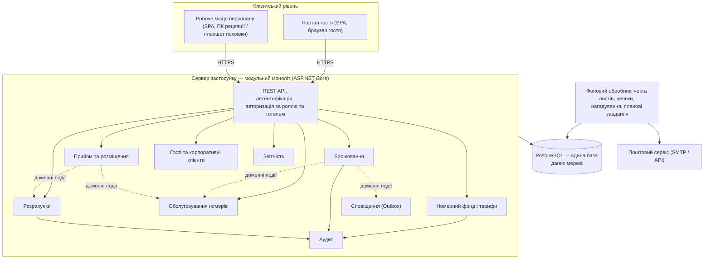
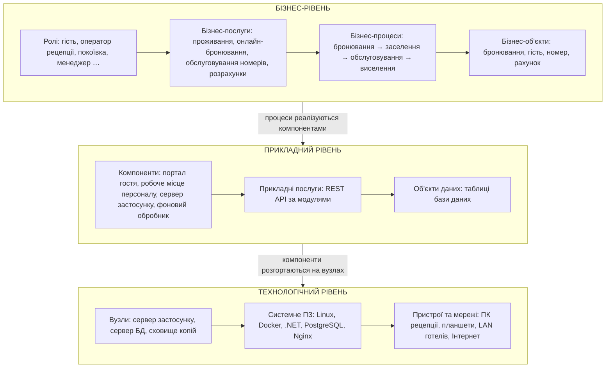
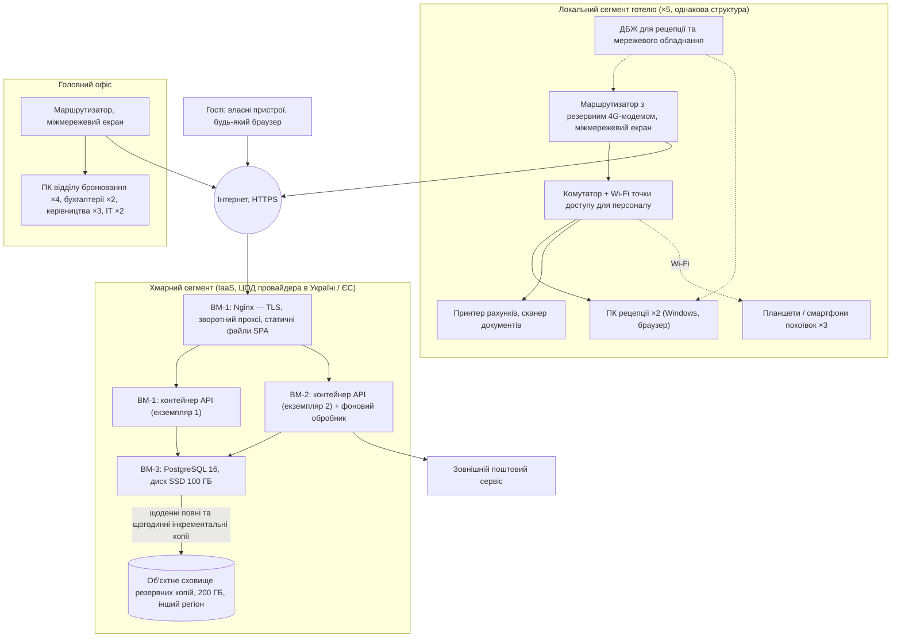

# ЗВІТ №1 з комп'ютерного практикуму

**Тема:** «Типова інформаційна система для мережі готелів»

*Чернетка розділів 9–10 (версія 0.1, прототип). Відповідність переліку викладача: розділ 9 = пункт 10 (архітектура продукту), розділ 10 = пункт 11 (архітектура на основі ІТ-інфраструктури, компоненти, специфікація обладнання). У звіті 1 ці розділи подаються як попередній варіант; повна версія — у звіті 2.*

---

## 9. АРХІТЕКТУРА ПРОДУКТУ (ПОПЕРЕДНІЙ ВАРІАНТ)

У цьому розділі наведено попередній варіант архітектури, достатній для початку розроблення: порівняно можливі архітектурні стилі та обрано найкращий за атрибутами якості і ризиками проєкту, визначено структурні елементи системи на трьох рівнях архітектури підприємства (бізнес-рівень, прикладний рівень, технологічний рівень) за підходом ArchiMate [8], а також обґрунтовано попередній вибір технологій. Деталізація архітектури (повні діаграми ArchiMate, діаграми компонентів і розгортання, проєкт бази даних) буде виконана у звіті 2 після уточнення вимог за результатами атестації.

### 9.1. Порівняння варіантів архітектури

Для системи розглянуто чотири архітектурні стилі [10]:

1. **Класичний моноліт** — один застосунок, у якому інтерфейс, бізнес-логіка та доступ до даних не мають жорстких внутрішніх меж; одна база даних; розгортається як єдине ціле.
2. **Модульний моноліт** — один застосунок, що розгортається як єдине ціле, але всередині поділений на модулі з чіткими межами (кожен модуль має власну частину моделі даних і взаємодіє з іншими лише через визначені інтерфейси); одна база даних зі схемами за модулями.
3. **Мікросервіси** — кожен модуль є окремим сервісом із власною базою даних, взаємодія через мережу (REST або повідомлення); незалежне розгортання та масштабування.
4. **Подієво-орієнтована архітектура (EDA)** — сервіси взаємодіють через брокер повідомлень, реагуючи на події (наприклад, «гостя виселено»); підвищена відв'язаність, асинхронність.

Варіанти оцінено за атрибутами якості, що випливають із нефункціональних вимог (розділ 6.3), та за ризиками проєкту (розділ 7.3). Оцінка — від 1 (погано) до 5 (відмінно); вага атрибута відображає його важливість для даного проєкту (таблиця 9.1).

**Таблиця 9.1 – Порівняння архітектурних стилів**

| Критерій (вимога / ризик) | Вага | Класичний моноліт | Модульний моноліт | Мікросервіси | EDA |
|---|---|---|---|---|---|
| Цілісність даних та атомарність операцій (NFR-04, R-01) | 5 | 5 | 5 | 2 | 2 |
| Швидкість розроблення командою з 2 осіб (R-07, R-13) | 5 | 4 | 4 | 1 | 1 |
| Простота розгортання та експлуатації силами ІТ-відділу з 2–3 осіб (NFR-18, R-02) | 4 | 5 | 5 | 2 | 2 |
| Супроводжуваність, чіткість меж модулів (NFR-16) | 4 | 2 | 5 | 5 | 4 |
| Масштабованість до 20 готелів / 2000 номерів (NFR-15) | 3 | 3 | 4 | 5 | 5 |
| Готовність до інтеграцій через API (NFR-21) | 3 | 3 | 4 | 5 | 5 |
| Продуктивність при цільовому навантаженні (NFR-01, NFR-02) | 3 | 4 | 4 | 4 | 4 |
| Можливість еволюції до мікросервісів у майбутньому | 2 | 1 | 5 | 5 | 5 |
| **Зважена сума (макс. 145)** | | **105** | **131** | **95** | **91** |

Розрахунок зваженої суми: для кожного варіанта оцінка множиться на вагу і сумується (наприклад, для модульного моноліту: 5·5 + 4·5 + 5·4 + 5·4 + 4·3 + 4·3 + 4·3 + 5·2 = 131).

**Обрано модульний моноліт.** Вирішальними стали три чинники:

- ключові операції системи (створення бронювання з перевіркою доступності, заселення, виселення) змінюють кілька сутностей одночасно і мають виконуватися атомарно (NFR-04); у моноліті це одна транзакція бази даних, тоді як у мікросервісах та EDA — розподілена транзакція або сага з компенсацією, що суттєво складніше і є джерелом помилок саме того типу, який ми визначили як найнебезпечніший (R-01 — подвійне бронювання);
- команда з двох осіб і обмежений термін (R-07) не дозволяють витрачати ресурси на інфраструктуру мікросервісів (брокер повідомлень, шлюз API, оркестрація контейнерів, розподілене журналювання); для мережі з 5 готелів і кількох десятків одночасних користувачів така інфраструктура не виправдана;
- модульна структура з чіткими межами (окремі модулі бронювання, номерного фонду, гостей, розрахунків тощо, взаємодія тільки через інтерфейси модулів) забезпечує супроводжуваність і дозволяє за потреби виділити окремі модулі в сервіси без переписування системи, коли мережа зросте.

Елементи подієвої архітектури використовуються всередині моноліту: зміни статусів публікуються як внутрішні доменні події (наприклад, «бронювання завершено»), на які реагують інші модулі (створення завдання на прибирання, формування сповіщення). Сповіщення надсилаються асинхронно через чергу в базі даних (шаблон Outbox), тому недоступність поштового сервісу не впливає на основні операції (R-10).

### 9.2. Загальна структура системи

Система складається з таких структурних елементів (рисунок 9.1):

- **Портал гостя** — публічний веб-застосунок (односторінковий, SPA) для пошуку, бронювання та особистого кабінету гостя.
- **Робоче місце персоналу** — захищений веб-застосунок (SPA) з окремими інтерфейсами для ролей: рецепція, відділ бронювання, служба обслуговування номерів (мобільна версія), менеджер, бухгалтер, адміністратор.
- **Сервер застосунку (API)** — модульний моноліт, що надає REST API для обох клієнтів і містить модулі: «Ідентифікація та доступ», «Номерний фонд і тарифи», «Бронювання», «Прийом та розміщення», «Гості», «Обслуговування номерів», «Розрахунки», «Звітність», «Сповіщення», «Аудит».
- **Фоновий обробник** — окремий процес того самого коду, що виконує відкладені та планові завдання: надсилання листів з черги, автоматичне позначення неявок, нагадування перед заїздом, формування планових завдань на прибирання.
- **База даних** — єдина реляційна база даних мережі (PostgreSQL) зі схемами за модулями.
- **Зовнішні сервіси** — поштовий сервіс (SMTP/API) для сповіщень; у майбутніх версіях — платіжний сервіс та сторонні майданчики бронювання через той самий API.

**Рисунок 9.1 – Загальна структура системи (попередній варіант)**

### 9.3. Архітектура на трьох рівнях (ArchiMate)

За методологією ArchiMate [8] і підходом TOGAF [9] архітектуру підприємства описують на трьох взаємопов'язаних рівнях: бізнес-рівень (хто і які послуги надає, які процеси виконує), прикладний рівень (які застосунки та їх функції підтримують процеси) і технологічний рівень (на якому обладнанні та системному програмному забезпеченні працюють застосунки). Попередній перелік елементів кожного рівня наведено в таблиці 9.2, а їх взаємозв'язок — на рисунку 9.2. Повні діаграми у нотації ArchiMate буде побудовано у звіті 2.

**Таблиця 9.2 – Елементи трьох рівнів архітектури (попередній перелік)**

| Рівень | Тип елемента | Елементи |
|---|---|---|
| Бізнес-рівень | Актори та ролі | Гість, корпоративний клієнт; оператор рецепції, оператор відділу бронювання, покоївка, старша покоївка, менеджер готелю, бухгалтер, керівництво мережі, адміністратор системи (розділ 4) |
| Бізнес-рівень | Бізнес-послуги | Проживання у номері, онлайн-бронювання, бронювання через контакт-центр, корпоративне обслуговування, додаткові послуги, обслуговування номерів, розрахунки (таблиця 7.5) |
| Бізнес-рівень | Бізнес-процеси | Бронювання номера; зміна та скасування бронювання; заселення; виселення; обслуговування номера; розрахунок з гостем; управління номерним фондом; формування звітності (сценарії розділу 8) |
| Бізнес-рівень | Бізнес-об'єкти | Бронювання, гість, номер, категорія номера, тариф, рахунок, платіж, завдання на прибирання |
| Прикладний рівень | Прикладні компоненти | Портал гостя; робоче місце персоналу; сервер застосунку з модулями (рисунок 9.1); фоновий обробник |
| Прикладний рівень | Прикладні послуги (інтерфейси) | REST API: автентифікація, пошук доступності, управління бронюваннями, заселення/виселення, гості, завдання на прибирання, рахунки та платежі, звіти, адміністрування |
| Прикладний рівень | Об'єкти даних | Таблиці бази даних, що відповідають бізнес-об'єктам, а також користувач, роль, історія змін, журнал аудиту, черга сповіщень (розділ 9.5) |
| Технологічний рівень | Вузли та пристрої | Сервер застосунку (віртуальна машина або контейнери у хмарі), сервер бази даних, сховище резервних копій; ПК рецепції, планшети покоївок, принтери, мережеве обладнання готелів (розділ 10) |
| Технологічний рівень | Системне ПЗ | Linux, Docker, ASP.NET Core Runtime, PostgreSQL, Nginx (зворотний проксі та TLS) |
| Технологічний рівень | Мережі та зовнішні сервіси | Інтернет (HTTPS), локальні мережі готелів, поштовий сервіс |

**Рисунок 9.2 – Взаємозв'язок рівнів архітектури (спрощена схема у стилі ArchiMate)**

### 9.4. Попередній вибір технологій

Вибір технологій зроблено з урахуванням трьох обмежень: наявних навичок команди (обидва учасники володіють C#), змісту дисципліни (у лекціях розглядаються платформи .NET та Spring Boot) та вимог до вартості (перевага безкоштовним і відкритим рішенням). Порівняння альтернатив наведено в таблиці 9.3; остаточне обґрунтування з оцінкою за критеріями буде подано у звіті 2 після побудови прототипу.

**Таблиця 9.3 – Попередній вибір технологій**

| Складова | Розглянуті альтернативи | Попередній вибір | Обґрунтування |
|---|---|---|---|
| Серверна платформа | ASP.NET Core (C#); Spring Boot (Java); Node.js / Express (JavaScript) | ASP.NET Core 8 | Досвід команди у C#; кросплатформність (Linux, контейнери); вбудовані засоби автентифікації, авторизації та валідації; висока продуктивність; розглядається у курсі |
| Доступ до даних | Entity Framework Core; Dapper; чистий SQL | Entity Framework Core | Міграції схеми (NFR-16), відображення сутностей на таблиці, підтримка транзакцій; для звітів за потреби — прямі SQL-запити |
| СУБД | PostgreSQL; Microsoft SQL Server; MySQL | PostgreSQL 16 | Безкоштовна і відкрита; надійні транзакції та блокування, необхідні для контролю доступності (FR-09); добре працює в контейнерах; підтримується EF Core |
| Клієнтська частина | React; Blazor WebAssembly; Angular; серверні Razor Pages | React (TypeScript) | Адаптивні інтерфейси для ПК і мобільних пристроїв (NFR-12, NFR-13); велика екосистема компонентів; поділ обов'язків у команді (один учасник — сервер, другий — клієнт) |
| Взаємодія клієнт–сервер | REST (JSON); GraphQL; gRPC | REST + OpenAPI (Swagger) | Простота, документованість API (NFR-21), зручність тестування |
| Автентифікація | Cookie-сесії; JWT | JWT з коротким терміном дії та refresh-токенами | Єдиний механізм для SPA-клієнтів; підтримка вимог до сесій (NFR-07) |
| Контейнеризація та запуск | Docker Compose; Kubernetes; встановлення на ВМ без контейнерів | Docker + Docker Compose | Відтворюване середовище розроблення і розгортання (NFR-18); Kubernetes надлишковий для даного масштабу |
| Зворотний проксі | Nginx; Caddy; Traefik | Nginx | Термінація TLS (NFR-06), роздача статичних файлів SPA, балансування між екземплярами при масштабуванні |
| Сповіщення | SMTP-сервер провайдера; API-сервіси розсилок | Абстракція постачальника; для практикуму — SMTP тестового сервера | Заміна постачальника без зміни коду (R-10) |
| Контроль версій та планування | GitHub; GitLab; Jira / Trello / GitHub Projects | GitHub + GitHub Projects | Репозиторій є вимогою до підсумкового звіту; дошка завдань в тому ж інструменті |
| Тестування | xUnit + FluentAssertions; NUnit | xUnit | Стандарт де-факто для .NET; автоматичні тести ключової логіки (NFR-16) |

### 9.5. Попередня структура бази даних

За бізнес-об'єктами (таблиця 9.2) та вимогами розділу 6 визначено попередній перелік сутностей бази даних (таблиця 9.4). Діаграму «сутність — зв'язок» та детальний опис таблиць буде наведено у специфікації даних (розділ 12, звіт 2).

**Таблиця 9.4 – Попередній перелік сутностей бази даних**

| Сутність | Призначення | Ключові атрибути та зв'язки |
|---|---|---|
| Hotel | Готель мережі | назва, місто, адреса, категорія, часовий пояс, активність |
| RoomCategory | Категорія номерів | назва, опис, базова місткість |
| Room | Номер готелю | готель, категорія, номер (унікальний у готелі), поверх, місткість, зручності, статус (FR-07), активність |
| Rate, SeasonRate | Тарифи | готель + категорія → базова ціна; сезонні періоди з ціною (FR-08) |
| Guest | Профіль гостя | ПІБ, контакти, документні дані, побажання, ознака підтвердження електронної пошти; необов'язковий зв'язок з обліковим записом (9.5.1) |
| CorporateClient | Корпоративний клієнт | назва, код ЄДРПОУ, договір, умови оплати, контактна особа (FR-26) |
| User, Role | Облікові записи та ролі | електронна пошта, хеш пароля, роль (рівно одна, зовнішній ключ), готель (область видимості), стан (FR-01 – FR-03) |
| Booking | Бронювання | готель, категорія, гість, корпоративний клієнт, дати заїзду/виїзду, кількість гостей, вартість, статус, джерело, призначений номер (необов'язковий, 9.5.1) (FR-10 – FR-16) |
| BookingHistory | Історія змін бронювання | бронювання, час, автор, тип події, поле, старе та нове значення (FR-17) |
| Invoice, InvoiceItem | Рахунок і його позиції | бронювання, стан, позиції (проживання, послуги) з кількістю та ціною (FR-31, FR-32) |
| Payment | Платіж | рахунок, дата, сума, спосіб (FR-33) |
| Service | Довідник додаткових послуг | назва, ціна, активність (FR-05) |
| HousekeepingTask | Завдання на прибирання | готель, номер, тип, пріоритет, термін, виконавець, статус (FR-27 – FR-30) |
| AuditLog | Журнал аудиту | час, користувач, сутність, ідентифікатор, дія, зміни (FR-04) |
| OutboxMessage | Черга сповіщень | тип, адресат, вміст, стан доставки, кількість спроб (FR-39, FR-40) |

Перелік містить 18 сутностей: у трьох рядках таблиці об'єднано по дві близькі сутності (Rate і SeasonRate, User і Role, Invoice і InvoiceItem). Кожній сутності відповідає одна таблиця бази даних — користувач має рівно одну роль, тому зв'язок «користувач — роль» реалізується зовнішнім ключем, а не окремою таблицею зв'язку. Розширення до кількох ролей на користувача до першої версії не входить.

#### 9.5.1. Уточнення до окремих зв'язків

Три зв'язки з таблиці 9.4 уточнено окремо, оскільки від них залежить логіка ключових операцій.

**Бронювання — номер (`Booking` → `Room`).** Зв'язок необов'язковий: бронювання виконується на категорію номерів, а не на конкретний номер (FR-09), тому при створенні бронювання посилання на номер порожнє. Воно заповнюється у двох випадках: при заселенні гостя (UC-12) або при попередньому призначенні номера в день заїзду, коли номер переводиться у стан «заброньований». Після заселення номер не змінюється, крім переселення (див. нижче). Розрахунок доступності виконується за категорією і цього посилання не враховує. Один номер не може бути одночасно призначений двом бронюванням у станах «підтверджене» (з призначенням) або «гість заселений» — це забезпечується частковим унікальним індексом. При скасуванні бронювання, за яким був призначений номер, в одній транзакції посилання очищується, а номер повертається у стан «вільний» (післяумова UC-07).

**Переселення заселеного гостя** (UC-06/А3, FR-21) виконується однією транзакцією: старий номер переводиться у стан «потребує прибирання» з автоматичним створенням завдання на прибирання типу «після виїзду» (окремий тип для переселення не вводиться, бо обсяг робіт той самий); новий номер — у стан «зайнятий»; посилання бронювання на номер оновлюється; в історію змін записуються старе і нове значення разом із причиною переселення, яку вказує оператор. Новий номер має бути у стані «вільний» — переселення в номер, що потребує прибирання, не дозволяється. Переселення можливе лише в номер тієї самої або вищої категорії; у другому випадку тариф залишається тарифом заброньованої категорії, категорія бронювання не змінюється і рахунок не перераховується — це рішення оператора, зафіксоване в історії.

**Гість — обліковий запис (`Guest` → `User`).** Зв'язок «один до одного», необов'язковий з обох боків: посилання на обліковий запис зберігається у профілі гостя, є необов'язковим і має унікальний індекс. Гість, який зареєструвався на порталі, має обліковий запис; гість, чий профіль створив оператор за телефонним бронюванням, — ні. Облікові записи персоналу профілю гостя не мають, тому зовнішній ключ розміщено саме у профілі гостя.

Якщо гість реєструється на порталі з поштою, яка вже є в наявному профілі, система прив'язує обліковий запис до цього профілю — але лише після підтвердження пошти листом (UC-01, крок 4), що доводить контроль над адресою. При першому вході в особистий кабінет система показує знайдену історію проживань із запитом на підтвердження та кнопкою «Це не я». У разі відмови зв'язок розривається, для облікового запису створюється порожній профіль, а в попередньому профілі пошта позначається як непідтверджена, щоб оператор виправив можливу помилку введення; подія записується в журнал аудиту. Ризик обмежений тим, що на порталі гість не бачить документних даних (NFR-09), тому навіть при помилці оператора розкриваються лише прізвище та історія проживань, а відмова зупиняє це на першому вході.

Окремий сценарій злиття дублікатів профілів до першої версії не входить: дублювання запобігається пошуком наявного профілю при створенні бронювання оператором (FR-24, UC-09/А1).

### 9.6. Стан робіт з реалізації

Для підтвердження початку робіт створено публічний репозиторій проєкту на GitHub: `https://github.com/ViktorKorkishko/zatyshok-pms`. Станом на подання звіту 1 репозиторій містить каркас, що відповідає обраній архітектурі (розділ 9.2) і попередньому вибору технологій (розділ 9.4):

- рішення `Zatyshok.sln` з проєктами `src/Zatyshok.Domain` (доменна модель), `src/Zatyshok.Infrastructure` (доступ до даних), `src/Zatyshok.Api` (сервер застосунку ASP.NET Core 8 з контролерами та Swagger), `src/Zatyshok.Worker` (фоновий обробник) і `tests/Zatyshok.Tests` (xUnit); залежності між проєктами налаштовано (Api і Worker → Infrastructure → Domain); рішення збирається і запускається;
- каркаси клієнтських застосунків `web/staff` (робоче місце персоналу) та `web/guest` (портал гостя) на React + TypeScript + Vite із зафіксованими версіями залежностей;
- `docs/` — цей звіт; `README.md`, `.gitignore`, ліцензія MIT.

Робота ведеться у гілках `feature/*` із злиттям у `main` через pull request, повідомлення комітів — у форматі Conventional Commits (`feat`, `chore`, `docs`, `test`), що дозволяє простежити хід робіт за історією репозиторію. Дошку завдань (GitHub Projects) із задачами за функціональними вимогами FR-xx буде створено на етапі планування (розділ 14 у звіті 2).

На наступному етапі каркас буде доповнено папками модулів у `Zatyshok.Api` (`Modules/Rooms`, `Modules/Bookings`, `Modules/FrontDesk`, `Modules/Guests`, `Modules/Housekeeping`, `Modules/Billing`, `Modules/Reporting`, `Modules/Notifications`, `Modules/Identity`, `Modules/Audit`), конфігурацією Docker Compose для локального запуску з PostgreSQL та міграціями бази даних. Наповнення каркасу кодом розпочинається після подання звіту 1 відповідно до плану робіт.

---

## 10. АРХІТЕКТУРА НА ОСНОВІ ІТ-ІНФРАСТРУКТУРИ (ПОПЕРЕДНІЙ ВАРІАНТ)

### 10.1. Варіанти розгортання

Оскільки мережа не має власного центру обробки даних, а ІТ-відділ налічує 2–3 фахівці (розділ 5), розглянуто три варіанти розміщення серверної частини (таблиця 10.1).

**Таблиця 10.1 – Порівняння варіантів розгортання серверної частини**

| Критерій | Власний сервер у головному офісі | Оренда віртуальної інфраструктури (IaaS) у хмарного провайдера | Платформа як послуга (PaaS: керовані контейнери та база даних) |
|---|---|---|---|
| Початкові витрати | Високі (сервер, ДБЖ, ліцензії, серверна шафа) | Низькі (оплата за використання) | Низькі |
| Щомісячні витрати | Електроенергія, канал зв'язку, обслуговування | Помірні, передбачувані | Вищі за IaaS, але без адміністрування ОС |
| Доступність (NFR-03) | Залежить від одного офісу: електроживлення, один канал зв'язку — ризик R-02 високий | SLA провайдера ≥ 99,5 %, резервоване живлення та канали | SLA провайдера, автоматичне відновлення |
| Масштабування (NFR-15) | Заміна обладнання | Зміна конфігурації ВМ за хвилини | Автоматичне |
| Резервне копіювання (NFR-05) | Організовує ІТ-відділ, потрібне окреме сховище поза офісом | Знімки дисків та об'єктне сховище провайдера | Вбудоване для керованої БД |
| Контроль над даними | Повний | Дані у провайдера; можливість обрати провайдера з центрами обробки даних в Україні або ЄС (NFR-09) | Те саме |
| Навантаження на ІТ-відділ | Найвище | Помірне (адміністрування ОС і контейнерів) | Найнижче |

**Обрано варіант IaaS**: оренда двох–трьох віртуальних машин у хмарного провайдера з центрами обробки даних в Україні або ЄС. Він поєднує низькі початкові витрати (обмеження бюджету, розділ 7.2), високу доступність без інвестицій у власне обладнання (R-02) і простоту масштабування, а адміністрування зводиться до підтримки контейнерів, що під силу невеликому ІТ-відділу. Завдяки контейнеризації (NFR-18) перехід на PaaS або на власний сервер у майбутньому не потребує зміни системи. Для комп'ютерного практикуму система розгортається локально через Docker Compose, що є повним функціональним аналогом хмарного варіанта.

### 10.2. Компоненти інфраструктури та схема розгортання

Інфраструктура складається з трьох частин: хмарного сегмента (серверна частина системи), локальних сегментів готелів (робочі місця персоналу) та головного офісу (робочі місця відділів). Усі сегменти взаємодіють із серверною частиною через Інтернет за протоколом HTTPS; окремих каналів між готелями не потрібно (рисунок 10.1).

**Рисунок 10.1 – Схема розгортання та мережевої інфраструктури (попередній варіант)**

Ключові рішення схеми:

- **Два екземпляри API** за зворотним проксі забезпечують продовження роботи при відмові одного з них та оновлення без простою (по черзі); фоновий обробник запускається в одному екземплярі, щоб уникнути дублювання листів.
- **Окрема віртуальна машина для бази даних** з SSD-диском: продуктивність (NFR-01) і незалежне масштабування; резервні копії зберігаються у об'єктному сховищі в іншому регіоні провайдера (NFR-05).
- **Готелям не потрібне серверне обладнання**: лише робочі місця, друк, планшети та надійний доступ до Інтернету з резервним 4G-каналом (R-12); при повній втраті зв'язку діє паперовий регламент рецепції (розділ 7.3, R-02).
- **Безпека периметра**: сервери приймають лише HTTPS-трафік через проксі; доступ до бази даних — тільки з внутрішньої мережі хмарного сегмента; адміністративний доступ — через VPN або SSH з ключами; на маршрутизаторах готелів — міжмережевий екран, окремі мережі для персоналу та для гостьового Wi-Fi.

### 10.3. Попередня специфікація обладнання

Специфікацію обладнання визначено, виходячи з масштабу мережі (5 готелів, 380 номерів, ~200 співробітників), ролей користувачів (розділ 4) та нефункціональних вимог (розділ 6.3). Обсяги віртуальних машин є попередніми і будуть уточнені за результатами навантажувального тестування у звіті 3. Наявне у готелях обладнання (ПК, принтери) використовується, якщо відповідає мінімальним вимогам; нижче вказано повний склад для типового готелю (таблиця 10.2) та хмарного сегмента (таблиця 10.3).

**Таблиця 10.2 – Обладнання типового готелю та головного офісу**

| Обладнання | Призначення | Мінімальні характеристики | Кількість на готель | Разом на мережу |
|---|---|---|---|---|
| ПК рецепції | Робоче місце оператора рецепції | 4-ядерний процесор, 8 ГБ ОЗП, SSD 256 ГБ, 2 монітори 24", Windows 11 або Linux, актуальний браузер | 2 | 10 |
| Принтер рахунків | Друк рахунків та підтверджень | Лазерний монохромний A4, мережевий | 1 | 5 |
| Сканер документів | Сканування документів гостей | Планшетний або протяжний, 300 dpi | 1 | 5 |
| Планшет або смартфон покоївки | Мобільне робоче місце служби обслуговування | Екран від 8" (планшет) або від 6" (смартфон), Android 12+, Wi-Fi, захисний чохол | 3 | 15 |
| Маршрутизатор з 4G-резервом | Доступ до Інтернету, міжмережевий екран, резервний канал | 2 WAN-порти (дротовий + 4G), VPN, VLAN для персоналу та гостей | 1 | 5 |
| Комутатор | Локальна мережа готелю | 16–24 порти Gigabit Ethernet, підтримка VLAN | 1 | 5 |
| Точка доступу Wi-Fi (службова мережа) | Зв'язок планшетів покоївок | Wi-Fi 5/6, покриття службових зон усіх поверхів | 2–4 (залежно від розміру готелю) | 15 |
| Джерело безперебійного живлення | Робота рецепції та мережі при перебоях живлення | 1000–1500 ВА, ≥ 30 хв автономності для ПК рецепції та мережевого обладнання | 1 | 5 |
| ПК головного офісу | Відділ бронювання (4), бухгалтерія (2), керівництво (3), ІТ-відділ (2) | Як ПК рецепції, 1 монітор (2 — для відділу бронювання) | — | 11 |

**Таблиця 10.3 – Віртуальна інфраструктура хмарного сегмента**

| Ресурс | Призначення | Характеристики | Кількість |
|---|---|---|---|
| ВМ-1 (застосунок) | Nginx + контейнер API, екземпляр 1 | 2 vCPU, 4 ГБ ОЗП, SSD 40 ГБ, Ubuntu Server LTS, Docker | 1 |
| ВМ-2 (застосунок) | Контейнер API, екземпляр 2 + фоновий обробник | 2 vCPU, 4 ГБ ОЗП, SSD 40 ГБ, Ubuntu Server LTS, Docker | 1 |
| ВМ-3 (база даних) | PostgreSQL 16 | 4 vCPU, 8 ГБ ОЗП, SSD 100 ГБ з можливістю розширення | 1 |
| Об'єктне сховище | Резервні копії бази даних та журналів, зберігання 30 днів | 200 ГБ, інший регіон або зона доступності | 1 |
| Публічна IP-адреса, DNS, TLS-сертифікат | Доступ клієнтів до системи | Доменне ім'я мережі, сертифікат Let's Encrypt з автоматичним оновленням | 1 |
| Моніторинг | Перевірка стану компонентів, сповіщення ІТ-відділу (NFR-19) | Вбудований моніторинг провайдера або Uptime Kuma у контейнері на ВМ-2 | 1 |

Обґрунтування обсягів: цільове навантаження (NFR-02) — до 100 одночасних внутрішніх користувачів і 500 відвідувачів порталу — для модульного моноліту на ASP.NET Core є невисоким; два екземпляри по 2 vCPU обрано насамперед для відмовостійкості, а не через продуктивність. Обсяг бази даних оцінено з запасом: за 5 років роботи при ~150 бронюваннях на день з історією змін, рахунками та журналом аудиту очікуваний обсяг даних не перевищує кількох десятків гігабайтів.

Орієнтовна вартість інфраструктури, порівняння конкретних провайдерів та план впровадження (послідовність підключення готелів, міграція даних) будуть наведені у звіті 2 разом із деталізованою архітектурою.
